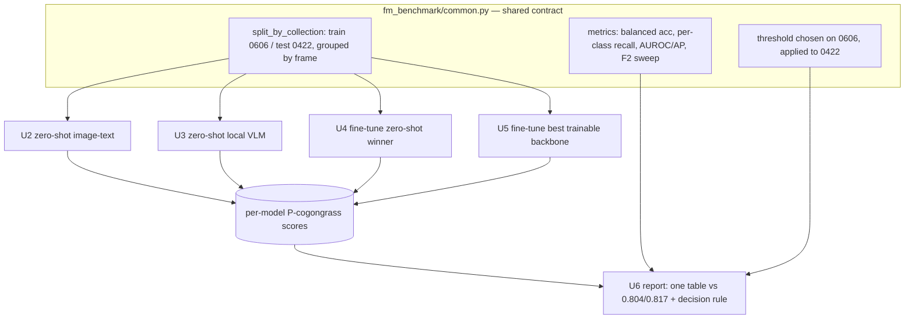

# feat: Foundation-Model Tile Benchmark (Zero-Shot + Light Fine-Tune)

## Summary

Build an isolated `fm_benchmark/` experiment that benchmarks the strongest
Spark-runnable off-the-shelf image models on the cogongrass tiles against the
existing 0.804 / 0.817 baselines. Two tracks — zero-shot (an image-text model + a
local VLM) and a light fine-tune (the zero-shot winner, plus the best *trainable*
backbone) — all on the one shared 0606→0422 field holdout, every model emitting a
per-tile cogongrass score into one shared scoring + reporting contract.

---

## Problem Frame

The maintained tile classifier needs labeled data and per-flight tuning to
generalize. The open question is whether a strong off-the-shelf model, run on the
now-available DGX Spark, gets close enough to retire that cost — and how much a
cheap fine-tune adds. The benchmark only answers this honestly if it (a) tests the
*strongest* Spark-runnable models rather than 2060-era sizes, (b) keeps the 0422
flight strictly held out with no leakage, and (c) sets the decision threshold
without peeking at the test field. See `origin:` for the full requirements.

---

## Key Technical Decisions

- **Reuse the existing cross-collection split verbatim — do not re-implement it.**
  `train_tiles_collection.py` and `train_tiles_dino.py` already define
  `frame_of` / `date_of` / `split_by_collection` / `balance`: train 0606, test the
  held-out 0422, grouped by frame so no frame's tiles span splits. The benchmark's
  shared module copies this logic so every track produces numbers comparable to the
  baselines and to each other (origin Key Decisions, R7).

- **One per-tile score contract for every model.** Each model — zero-shot image-text,
  zero-shot VLM, fine-tuned — emits a per-tile `P(cogongrass)` in `[0,1]` plus the
  true label, written to a uniform per-model results file. This lets the shared
  evaluator compute identical metrics and lets the F2 threshold sweep
  (`threshold_sweep.py` pattern) apply unchanged across models.

- **Honest threshold selection.** Report threshold-free metrics (AUROC, average
  precision) as the primary zero-shot comparison, AND select any fixed operating
  threshold on the **0606 train field**, then apply it to 0422 — never sweep the
  threshold on 0422 itself. The existing `threshold_sweep.py` sweeps directly on
  0422 for the *trained* model; reusing that for zero-shot would peek at the test
  field. This is the one deviation from the existing sweep script's behavior.

- **Two model-selection roles.** Zero-shot is restricted to image-text models
  (CLIP/SigLIP/EVA-CLIP class — they need a text encoder for prompts). The fine-tune
  track separately picks the best *trainable* backbone for transfer strength,
  explicitly allowing a vision-only DINOv2-class backbone with no zero-shot score
  (origin Key Decisions, R4, R5).

- **Library choices (directional).** `open_clip` / HuggingFace `transformers` for the
  image-text models and the local VLM; `torch.hub` DINOv2 for the trainable backbone
  (matching `train_tiles_dino.py`). Fine-tune defaults to a frozen-feature linear
  probe (cheapest, attributable), with light full fine-tune as the deferred depth
  choice. Exact checkpoints come from the planning-fixed shortlist.

- **Backbones meant to be evaluated on 0422 keep BatchNorm where present**, so AdaBN
  (recompute BN running stats on the target tiles before predicting) stays available
  — the repo's deployment pattern in `heatmap_infer.py` / `threshold_sweep.py`.

---

## High-Level Technical Design



*Directional — shows the fan-in to one scoring contract and shared evaluator, not a
module spec.*

---

## Output Structure

```
fm_benchmark/
  README.md                      # how to run the benchmark end-to-end
  common.py                      # shared split + scoring contract + metrics + table
  smoke_spark.py                 # U7: fit-and-train check per shortlisted model
  zeroshot_clip.py               # U2: image-text zero-shot scorer
  zeroshot_vlm.py                # U3: local open-VLM zero-shot scorer
  finetune_zeroshot_winner.py    # U4: fine-tune the zero-shot winner
  finetune_best_backbone.py      # U5: fine-tune the best trainable backbone
  report.py                      # U6: aggregate -> comparison table + decision rule
  results/                       # per-model score files + the final table (git-ignored)
```

The per-unit `Files:` lists are authoritative; the tree is the intended shape.

---

## Implementation Units

### U1. Shared split, scoring contract, and metrics module

- **Goal:** One module every track imports, so the split, the per-tile score format,
  and the metrics are defined once and are identical across models.
- **Requirements:** R6, R7, R8 (establishes the isolated `fm_benchmark/` root,
  `README.md`, and `results/` convention); enforces the no-leakage success criterion.
- **Dependencies:** none.
- **Files:** `fm_benchmark/common.py`, `fm_benchmark/README.md`.
- **Approach:** Port `frame_of` / `date_of` / `split_by_collection` / `balance` from
  `train_tiles_collection.py` (test left at natural distribution). Define a
  `ScoreRecord` format (tile path, frame, true label, `P(cogongrass)`) and a writer
  to `fm_benchmark/results/<model>.jsonl`. Provide metric helpers: balanced
  accuracy, per-class recall, AUROC, average precision, and an F2 sweep mirroring
  `threshold_sweep.py`; plus a `pick_threshold_on(train_scores)` helper that selects
  the operating point on 0606 only. Balanced accuracy, per-class recall, and the F2
  sweep mirror existing scripts; AUROC / average precision are net-new helpers
  (`sklearn.metrics.roc_auc_score` / `average_precision_score`), absent from the repo.
- **Patterns to follow:** `train_tiles_collection.py` (split/balance), `threshold_sweep.py`
  (F2 sweep, AdaBN), `datasets.ImageFolder` over `tiles_dataset/` with classes
  `["cogongrass","not_cogongrass"]`.
- **Test scenarios:**
  - No-leakage assertion: the 0606 and 0422 index sets are disjoint, and no `frame_of`
    value appears in both — assert on the real `tiles_dataset/`.
  - Score-contract validation: a written record round-trips and every `P(cogongrass)`
    is within `[0,1]`.
  - Threshold honesty: `pick_threshold_on` receives only 0606-derived scores; assert
    it never reads the 0422 split (e.g. takes train scores as an explicit argument).
  - Metric sanity: on a tiny synthetic perfect-separation set, balanced accuracy and
    AUROC both equal 1.0.
- **Verification:** importing `common` and running its self-checks prints the split
  frame counts (train 0606 / test 0422) matching the existing collection scripts.

### U7. DGX Spark fit-and-train smoke test

- **Goal:** Confirm each shortlisted model loads and *trains* one step at the intended
  batch size on the Spark before committing the heavier tracks; record a fallback.
- **Requirements:** origin Dependencies/Assumptions (Spark fit-and-train check).
- **Dependencies:** U1.
- **Files:** `fm_benchmark/smoke_spark.py`.
- **Approach:** For each model in the planning-fixed shortlist, load weights, run a
  forward on one tile batch, and (for trainable backbones) one backward/optimizer
  step at the target batch size. Report fit/OOM and a fallback model/batch. Runs
  first so a bad choice fails cheaply.
- **Patterns to follow:** AMP autocast + `torch.amp.GradScaler` usage in
  `train_tiles_collection.py`; Windows `if __name__ == "__main__":` guard.
- **Test scenarios:**
  - Happy: a small model loads and completes a forward+backward step; script reports
    "fits".
  - Failure path: a deliberately oversized batch is caught and reported as OOM with a
    fallback, not an uncaught crash.
- **Verification:** prints a per-model fit/train table; at least one image-text model
  and one trainable backbone are marked runnable.

### U2. Zero-shot image-text scorer

- **Goal:** Score the full held-out 0422 set zero-shot with the strongest
  Spark-runnable image-text model, via a descriptive-prompt ensemble.
- **Requirements:** R1, R3.
- **Dependencies:** U1, U7.
- **Files:** `fm_benchmark/zeroshot_clip.py`.
- **Approach:** Load an `open_clip` / `transformers` model from the shortlist (selection
  criterion: largest open-weight that fits Spark memory). Build positive and negative
  prompt ensembles; embed all 0422 tiles; `P(cogongrass)` = softmax over
  mean-positive vs mean-negative text similarity. Write scores via the U1 contract.
  Report AUROC/AP plus metrics at a 0606-selected threshold.
- **Patterns to follow:** Use each model's *own* preprocessing for resize +
  normalization (`open_clip`'s `create_model_and_transforms` preprocess, or
  `transformers` `AutoProcessor`) — **not** the repo's ImageNet `eval_tf`, which
  would mismatch CLIP/SigLIP mean/std and input resolution and silently depress
  zero-shot scores. Reuse only the U1 split and score contract from the repo.
- **Test scenarios:**
  - Score range: every emitted `P(cogongrass)` is within `[0,1]`; row count equals the
    0422 tile count (~7,006).
  - Prompt-ensemble effect: swapping the bare label for the descriptive ensemble
    changes scores (guards against a no-op ensemble).
  - Threshold provenance: the reported operating threshold was selected from 0606
    scores, not 0422.
- **Verification:** `results/zeroshot_clip.jsonl` exists with one row per 0422 tile and
  a printed AUROC/AP + balanced accuracy line.

### U3. Zero-shot local VLM scorer

- **Goal:** Score 0422 zero-shot with a locally-run open VLM, keeping the VLM result
  on-goal (locally deployable) and comparable to the other local numbers.
- **Requirements:** R2.
- **Dependencies:** U1, U7.
- **Files:** `fm_benchmark/zeroshot_vlm.py`.
- **Approach:** Load a local open VLM (Qwen2-VL / InternVL / Llama-3.2-Vision class) via
  `transformers`. Per tile, prompt for a cogongrass yes/no plus a 0–1 confidence; map
  to `P(cogongrass)` and write via the U1 contract. Full 0422 set if throughput
  allows; otherwise a stratified subsample, logged explicitly as reduced coverage.
- **Patterns to follow:** U1 score contract; isolated-folder convention.
- **Test scenarios:**
  - Parse robustness: a malformed VLM response (missing confidence, extra prose) is
    handled without crashing and is counted as an explicit abstain/fallback, not a
    silent drop.
  - Score range and coverage: emitted scores within `[0,1]`; if subsampled, the
    coverage count is recorded in the output, not silently dropped.
- **Verification:** `results/zeroshot_vlm.jsonl` exists with recorded coverage and a
  printed metric line.

### U4. Fine-tune the zero-shot winner (attributable lift)

- **Goal:** Fine-tune the best Track-1 image-text model on 0606, evaluate on 0422,
  report the lift over its own zero-shot score.
- **Requirements:** R4.
- **Dependencies:** U1, U2.
- **Files:** `fm_benchmark/finetune_zeroshot_winner.py`.
- **Approach:** Frozen-feature linear probe (default) on the winner's image encoder;
  train on 0606 (validation carved from 0606), evaluate on 0422 via the U1 contract.
  Report fine-tuned metric minus the U2 zero-shot metric for the same model.
- **Execution note:** light fine-tune only — no hyperparameter search (origin Scope
  Boundaries).
- **Patterns to follow:** frozen-backbone-plus-head `DinoNet` shape and training loop
  in `train_tiles_dino.py`; `balance`/early-stopping from `train_tiles_collection.py`.
- **Test scenarios:**
  - No-leakage: train and validation indices are all 0606; 0422 appears only at eval.
  - Lift computation: reported lift equals fine-tuned metric minus this model's
    recorded U2 zero-shot metric on the same 0422 set.
  - Determinism: fixed seed reproduces the held-out balanced accuracy across two runs.
- **Verification:** prints zero-shot vs fine-tuned balanced accuracy + the lift; writes
  `results/finetune_winner.jsonl`.

### U5. Fine-tune the best trainable backbone

- **Goal:** Fine-tune the strongest *trainable* backbone (selected for transfer
  strength, may be vision-only DINOv2-class) on 0606, evaluate on 0422 — the
  achievable off-the-shelf number, uncapped by zero-shot rank.
- **Requirements:** R5.
- **Dependencies:** U1, U7.
- **Files:** `fm_benchmark/finetune_best_backbone.py`.
- **Approach:** Frozen DINOv2-class backbone + trainable head, train 0606 / eval
  0422; report lift over its own frozen / linear-probe baseline. For AdaBN to apply
  at eval, the trainable head must contain `nn.BatchNorm2d` — the plain `DinoNet`
  head in `train_tiles_dino.py` is Dropout + Linear (no BatchNorm), so AdaBN would
  be a silent no-op there. Use the BatchNorm-bearing conv head from
  `train_tiles_dino_spatial.py` instead; if a no-BatchNorm head is chosen, drop the
  AdaBN step for this track rather than claiming it.
- **Execution note:** light fine-tune only.
- **Patterns to follow:** `train_tiles_dino_spatial.py` (dense patch tokens + conv
  head **with BatchNorm**, kept so AdaBN test-time adaptation applies); eval loop and
  frozen-backbone training from `train_tiles_dino.py`.
- **Test scenarios:**
  - No-leakage: train/val all 0606; 0422 eval-only.
  - Frozen-baseline lift: reported lift is relative to this backbone's own
    frozen/linear-probe score, not the zero-shot winner's.
  - Backbone eligibility: a vision-only backbone with no text head runs here without
    requiring a zero-shot score.
- **Verification:** prints frozen vs fine-tuned balanced accuracy + lift; writes
  `results/finetune_backbone.jsonl`.

### U6. Comparison report and decision rule

- **Goal:** Aggregate every model's scores into one comparison against the 0.804 /
  0.817 baselines and apply the pre-committed keep/retire decision rule.
- **Requirements:** R6, R7; Success Criteria.
- **Dependencies:** U2, U3, U4, U5.
- **Files:** `fm_benchmark/report.py`.
- **Approach:** Read all `results/*.jsonl`, compute balanced accuracy + per-class
  recall + F2 (threshold from 0606) + AUROC/AP per model, and render one table with
  the baselines as rows. Apply the decision rule: off-the-shelf "good enough" only if
  a model meets/exceeds baseline by the stated margin; matching-not-exceeding and
  light-fine-tune-below-baseline default to keeping the pipeline (mark the latter
  "inconclusive").
- **Patterns to follow:** metric helpers from U1; reporting style in `threshold_sweep.py`.
- **Test scenarios:**
  - Table completeness: every model that produced a results file appears as a row,
    with the two baselines present.
  - Decision-rule correctness: a synthetic model above baseline+margin reads "good
    enough"; one matching baseline reads "keep pipeline"; a light-fine-tune below
    baseline reads "inconclusive".
  - Comparability guard: the remote API VLM (if present) is labeled non-comparable and
    excluded from the headline decision.
- **Verification:** writes `results/comparison.md` (or printed table) showing all
  models vs baselines and the decision verdict.

---

## Risks & Dependencies

- **Load-bearing assumption (carried from origin): 0422 and 0606 are physically
  different fields.** If 0422 is the same parcel reflown, field identity leaks across
  the date split and every headline number is a same-field result. Confirm before
  trusting the held-out numbers as a new-field read; this is a product assumption, not
  a plan-time fix.
- **Spark environment:** ARM64 + new CUDA arch + unified memory means prebuilt wheels
  and large-model fit are not guaranteed. U7 runs first to surface this cheaply; a
  fallback model/batch is recorded.
- **VLM throughput:** per-tile VLM inference over ~7,006 tiles may be slow; U3 may fall
  back to a logged subsample.

---

## Open Questions

Deferred to planning/implementation:
- The exact shortlist checkpoints per track (criterion fixed: strongest open-weight
  that fits Spark memory).
- Fine-tune depth (linear probe vs light full fine-tune) — pick per the zero-shot
  result.
- Whether to run an optional remote API VLM reference point, and its subsample size.
- The exact F2 / balanced-accuracy margin in the decision rule.
