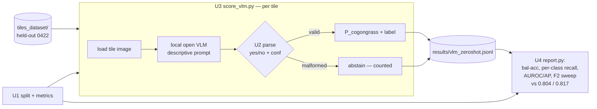

# feat: Local VLM Zero-Shot Tile Test (focused standalone harness)

## Summary

Stand up a small, self-contained `vlm_zeroshot/` harness that points a **local open
VLM** (Qwen2-VL / InternVL / Llama-3.2-Vision class, run on the DGX Spark) at the
cogongrass tiles and asks it, per tile, *"is this cogongrass?"* — zero-shot, no
training. It scores the held-out **0422** flight, parses each VLM answer into a
`P(cogongrass)`, and reports balanced accuracy + per-class recall + an F2 threshold
sweep against the existing **0.804 / 0.817** cross-collection baselines. This is the
narrow "how far does an off-the-shelf VLM get with zero shot?" question carved out of
the larger `fm_benchmark` plan (this maps to that plan's U3), runnable on its own.

This plan deliberately scopes to **one question and one model class**. It is *not* the
full foundation-model benchmark — no CLIP/SigLIP track, no fine-tune, no shared
`fm_benchmark/common.py`. The harness is self-contained so it can run before (or
independently of) that larger effort.

---

## Problem Frame

The maintained tile classifier needs labeled data and per-flight tuning to generalize
to a new flight. A strong VLM may already "know" what cogongrass looks like well enough
to classify tiles from a prompt alone. The question is empirical and narrow: **run a
local open VLM zero-shot over the held-out 0422 tiles and see how close its raw
yes/no judgment gets to the trained baselines** — with no leakage and an honest
operating threshold. The answer is a capability read, not a deployment change. See
`origin:` (requirements R2, R6, R7, R8 and the cross-collection protocol) for the
surrounding context.

---

## Key Technical Decisions

- **Reuse the existing cross-collection split — copy it, don't depend on `fm_benchmark`.**
  `train_tiles_collection.py:39-61` already defines `frame_of` / `date_of` /
  `split_by_collection`. The harness copies those helpers into its own module so it
  stays self-contained (the larger `fm_benchmark/common.py` does not exist yet and this
  plan must not block on it). The held-out set is every tile whose frame
  `date_of(frame_of(path)) == "20260422"`, grouped by frame so no frame spans splits —
  identical to how the baselines and `threshold_sweep.py:37` select 0422.

- **Zero-shot means evaluate on 0422; only *touch* 0606 to pick a threshold.** There is
  no training. The primary metrics are **threshold-free** (AUROC, average precision) on
  0422, because they need no operating point at all. If a single fixed yes/no operating
  threshold is reported, it is selected on **0606 scores only** and applied to 0422 —
  never swept on 0422 itself (that would peek at the test field). This mirrors the
  honest-threshold decision in the origin plan and is the one place 0606 is read.

- **The VLM emits a yes/no *and* a 0–1 confidence; both are used.** The native yes/no is
  what the model actually decides (reported as-is for balanced accuracy + per-class
  recall). The confidence gives a continuous score for AUROC/AP and for the F2 sweep.
  A malformed or missing answer is an explicit **abstain**, counted and reported — never
  silently dropped and never guessed as a class.

- **Prompt is a descriptive ensemble, not the bare label.** The prompt describes
  cogongrass's appearance (tall, feathery, pale/silvery seed plume, dense clump) and
  asks for a strict, parseable verdict. Prompt wording is the only knob in zero-shot, so
  it is fixed at planning and versioned in the harness, with the exact text owned by the
  prompt module (U2).

- **Throughput is a first-class concern; coverage is logged, never silent.** Per-tile
  inference with a 7B+ VLM over ~7,006 tiles is slow. The scorer runs the full 0422 set
  when feasible; if it falls back to a **stratified subsample** (preserving the
  cogongrass / not-cogongrass ratio), the realized coverage count is written into the
  output and surfaced in the report — a reduced run is labeled, not disguised as full.

- **Model shortlist is planning-fixed; the criterion is "strongest open VLM that fits
  Spark memory."** Default workhorse: **Qwen2-VL-7B-Instruct** (well-supported in
  `transformers`, reliable structured output). Scale up if Spark unified memory allows:
  **InternVL2-26B**, **Qwen2-VL-72B**, or **Llama-3.2-90B-Vision**. A one-tile load +
  parse smoke check (U3 `--limit`) runs first so an ARM64/CUDA-arch fit problem fails
  cheaply before the full sweep. *(Directional — exact checkpoint picked at run time
  from what loads on the Spark; record the one actually used in the results file.)*

- **Isolated folder, own log; baseline scripts untouched.** Everything lives under
  `vlm_zeroshot/`; results and logs are git-ignored. No edit to `tile_classifier.pt`,
  `train_tiles*.py`, or any baseline script (origin R8).

---

## High-Level Technical Design



*Directional — shows the per-tile scoring path and the fan-in to one report, not a
module spec. The 0606 threshold-selection path (optional) reuses the same scorer with a
different split slice and is omitted here for clarity.*

---

## Output Structure

```
vlm_zeroshot/
  README.md            # how to run on the Spark, model selection, throughput notes
  common.py            # U1: copied split helpers + scoring contract + metrics
  prompt.py            # U2: descriptive prompt ensemble + response parser
  score_vlm.py         # U3: load local VLM, iterate tiles, write scores (+ --limit smoke)
  report.py            # U4: aggregate -> metrics table vs 0.804/0.817 + F2 sweep
  results/             # vlm_zeroshot.jsonl + comparison output (git-ignored)
```

The per-unit `Files:` lists are authoritative; this tree is the intended shape. Add
`vlm_zeroshot/results/` to `.gitignore`.

---

## Implementation Units

### U1. Self-contained split, scoring contract, and metrics

- **Goal:** One small module the harness imports so the held-out split, the per-tile
  score format, and the metrics are defined once and match the baselines.
- **Requirements:** R6 (balanced accuracy + per-class recall, never raw accuracy), R7
  (compare against 0.804 / 0.817), R8 (isolated folder); no-leakage success criterion.
- **Dependencies:** none.
- **Files:** `vlm_zeroshot/common.py`, `vlm_zeroshot/README.md`.
- **Approach:** Copy `frame_of`, `date_of`, and the 0422-selection logic from
  `train_tiles_collection.py:39-61` (test = all frames with `date_of == "20260422"`,
  grouped by frame; an optional 0606 slice for threshold selection). Enumerate tiles via
  `datasets.ImageFolder("tiles_dataset")` to get `(path, label)` and the
  `cogongrass` class index — but **do not** apply the repo's ImageNet `eval_tf`
  transforms; the VLM consumes raw images through its own processor (U3). Define a
  `ScoreRecord` (tile path, frame, true label, `P(cogongrass)` in `[0,1]`, `abstained`
  bool) and a JSONL writer/reader to `vlm_zeroshot/results/`. Provide metric helpers:
  balanced accuracy, per-class recall, AUROC, average precision (`sklearn.metrics`), and
  an F2 sweep mirroring `threshold_sweep.py:64-75`, plus `pick_threshold_on(scores)`
  that selects an operating point from 0606 scores only.
- **Patterns to follow:** `train_tiles_collection.py` (`frame_of` / `date_of` /
  frame-grouped split), `threshold_sweep.py:64-75` (F2 sweep + reporting style),
  `datasets.ImageFolder` over `tiles_dataset/` with classes `["cogongrass",
  "not_cogongrass"]`.
- **Test scenarios:**
  - No-leakage: on the real `tiles_dataset/`, the 0422 and 0606 index sets are disjoint
    and no `frame_of` value appears in both.
  - Score-contract round-trip: a `ScoreRecord` written then re-read is unchanged; every
    `P(cogongrass)` is within `[0,1]`; an abstained record is readable and flagged.
  - Threshold honesty: `pick_threshold_on` takes scores as an explicit argument and is
    only ever passed 0606-derived scores (assert it cannot read the 0422 slice).
  - Metric sanity: on a tiny synthetic perfect-separation set, balanced accuracy and
    AUROC both equal 1.0; on all-one-class predictions, balanced accuracy reflects the
    miss (not inflated raw accuracy).
- **Verification:** importing `common` and running its self-check prints 0422 frame/tile
  counts matching `train_tiles_collection.py`'s held-out counts.

### U2. Descriptive prompt ensemble + response parser

- **Goal:** Turn a tile into a strict VLM verdict and turn any VLM reply into a
  `P(cogongrass)` or an explicit abstain — the heart of the zero-shot test, fully
  unit-testable without the model.
- **Requirements:** R2 (per-tile prediction + confidence), R3 (descriptive prompt, not
  the bare label).
- **Dependencies:** U1 (score contract).
- **Files:** `vlm_zeroshot/prompt.py`.
- **Approach:** Define the versioned descriptive prompt: describe cogongrass appearance
  (tall, feathery, pale/silvery seed plume, dense clump in oblique drone view) and
  instruct the model to answer in a strict, parseable form (e.g. a `yes/no` plus a `0–1`
  confidence, or a small JSON object). Provide `build_prompt()` and `parse_response(text)
  -> (p_cogongrass | None)`: map an affirmative + confidence `c` to `P = c`, a negative +
  confidence `c` to `P = 1 - c`, and a missing/contradictory/unparseable reply to `None`
  (abstain). Parsing is defensive — tolerate extra prose, casing, and surrounding
  punctuation; never throw on bad input.
- **Patterns to follow:** keep the prompt text and parse logic colocated and pure (no
  model/IO) so they test in isolation; isolated-folder convention.
- **Test scenarios:**
  - Happy path: `"yes, confidence 0.9"` -> `P ~= 0.9`; `"no (0.8)"` -> `P ~= 0.2`;
    a clean JSON verdict parses to the same.
  - Prompt-ensemble guard: `build_prompt()` output contains the appearance description,
    not just the word "cogongrass" (so the descriptive ensemble can't silently
    degrade to a bare label).
  - Edge cases: confidence clamped to `[0,1]` when the model returns `1.2` or a
    percentage like `"90%"`; missing confidence defaults to a documented value, not a
    crash.
  - Error/abstain path: empty string, pure prose with no verdict, and a contradictory
    `"yes ... actually no"` all return `None` (abstain), not a guessed class.
- **Verification:** `pytest`/`python -m` over `prompt.py` passes; a table of representative
  replies maps to the expected `P` or abstain.

### U3. Local VLM zero-shot scorer

- **Goal:** Load a local open VLM on the Spark and score the held-out 0422 tiles
  zero-shot, writing one record per tile via the U1 contract — with a cheap fit-check
  mode and explicit coverage logging.
- **Requirements:** R2; origin Dependencies/Assumptions (Spark fit check, locally
  deployable VLM).
- **Dependencies:** U1, U2.
- **Files:** `vlm_zeroshot/score_vlm.py`.
- **Approach:** Load the shortlisted VLM via `transformers` (`AutoModelForVision2Seq` /
  `AutoProcessor`, model id from `--model`, default Qwen2-VL-7B-Instruct). Iterate the
  0422 tiles from U1; for each, feed the raw image + `build_prompt()` through the model's
  **own** processor (not the repo's ImageNet transforms), decode, `parse_response`, and
  write a `ScoreRecord` (abstains included). A `--limit N` flag runs only N tiles as the
  Spark load+parse smoke test (runs first, fails cheaply on an ARM64/CUDA-arch or OOM
  problem). Support full-0422 by default and a `--subsample K` stratified mode that
  preserves the class ratio and records realized coverage in the output. Record the
  actual model id and tile count in the results file. Optional `--split 0606` slice
  reuses the same path to produce threshold-selection scores. Guard `main()` with
  `if __name__ == "__main__":` (multiprocessing/dataloader safety).
- **Execution note:** run `--limit 8` first on the Spark to confirm the model loads and
  one tile round-trips through parse before launching the full sweep.
- **Patterns to follow:** AMP autocast usage and the `if __name__ == "__main__":` guard
  in `train_tiles_collection.py`; per-tile inference loop shape from
  `threshold_sweep.py:57-60` (minus the torch model and AdaBN — not applicable to a VLM).
- **Test scenarios:**
  - Smoke/happy: `--limit 4` against a stub/mock VLM returning canned replies writes 4
    valid records and exits 0.
  - Coverage honesty: `--subsample 100` records realized count and the class ratio in
    the output; the report can later read that coverage (not silently treated as full).
  - Parse robustness end-to-end: a stubbed malformed reply produces an abstained record,
    not a crash and not a guessed class.
  - Provenance: the written results file records the model id and the split actually
    scored (0422 vs 0606).
- **Verification:** `results/vlm_zeroshot.jsonl` exists with one row per scored 0422 tile
  (or recorded subsample), the model id, and a printed count of scored / abstained tiles.

### U4. Report and comparison vs baselines

- **Goal:** Turn the scores into one read — balanced accuracy + per-class recall + AUROC/AP
  + an F2 sweep — against the 0.804 / 0.817 baselines, with abstains and coverage shown.
- **Requirements:** R6, R7; Success Criteria (clear read on how close zero-shot gets).
- **Dependencies:** U1, U3.
- **Files:** `vlm_zeroshot/report.py`.
- **Approach:** Read `results/vlm_zeroshot.jsonl`; compute on the **non-abstained** 0422
  records: balanced accuracy + per-class recall on the VLM's native yes/no decision,
  AUROC + average precision on the confidence score, and an F2 sweep
  (`threshold_sweep.py` style). If a 0606 score slice exists, also report the operating
  point at the 0606-selected threshold applied to 0422; otherwise report threshold-free
  metrics as primary and say so. Render one table with the **0.804 (ResNet18)** and
  **0.817 (Stage-1 DA)** cross-collection numbers as comparison rows, and print the
  abstain count + realized coverage so a partial run is never read as a full one.
- **Patterns to follow:** metric helpers from U1; reporting/printing style in
  `threshold_sweep.py:63-75`.
- **Test scenarios:**
  - Table completeness: output includes the VLM row plus both baseline rows; balanced
    accuracy, per-class recall, AUROC/AP, and the F2 sweep are all present.
  - Abstain/coverage surfacing: a results file with N abstains and a subsample reports
    both counts; metrics are computed over scored tiles only, with the denominator shown.
  - Threshold provenance: when a 0606 slice is present, the reported operating threshold
    came from 0606; when absent, the report states metrics are threshold-free.
  - Decision read: a synthetic perfect-VLM results file reports balanced accuracy near
    1.0 above the baselines; a coin-flip file reports ~0.5, clearly below.
- **Verification:** prints (and writes `results/vlm_comparison.md`) a table showing the
  VLM zero-shot numbers beside 0.804 / 0.817, with abstain + coverage lines.

---

## Risks & Dependencies

- **Spark + tiles must be present together.** The tile data is git-ignored and absent on
  this machine; this harness runs where `tiles_dataset/` and the Spark GPU live. Confirm
  the dataset path on the Spark before the full run.
- **Spark is ARM64 + new CUDA arch + unified memory** — prebuilt `transformers`/VLM
  wheels and large-checkpoint fit are not guaranteed. U3 `--limit` is the cheap fit gate;
  fall back to a smaller shortlist model (Qwen2-VL-7B) if a larger one OOMs or won't load.
- **VLM throughput over ~7,006 tiles is the dominant cost.** Expect to either batch
  aggressively or fall back to a logged stratified subsample (U3 `--subsample`); the
  report surfaces realized coverage so a reduced run isn't mistaken for full.
- **Load-bearing assumption (carried from origin): 0422 and 0606 are physically different
  fields.** Less central here than in the fine-tune tracks (zero-shot does no training),
  but the "new flight it has never seen" framing still relies on 0422 being a genuinely
  held-out field. Confirm before reading the number as a new-field result.

---

## Open Questions

Deferred to run time:
- Exact VLM checkpoint (criterion fixed: strongest open VLM that loads + fits on the
  Spark; default Qwen2-VL-7B-Instruct). Record the one used in the results file.
- Whether to score a 0606 slice for a fixed operating threshold, or report threshold-free
  AUROC/AP only — decide once 0422 throughput is known.
- Subsample size/stratification if the full 0422 run is too slow.
- Final descriptive-prompt wording — fixed in U2 but worth a quick A/B of one or two
  phrasings on the `--limit` smoke set before the full sweep.
