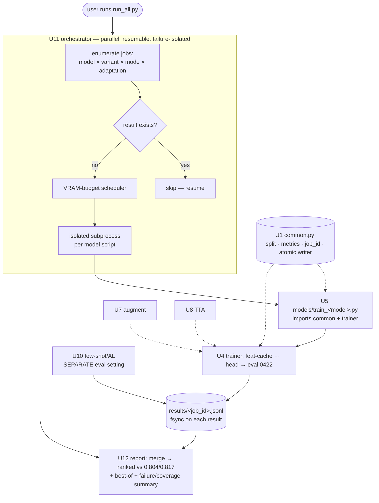

# feat: Traditional-ML architecture sweep for cogongrass tile detection (Stages 0–2 + adaptation)

## Summary

Build a set of **separate per-model training scripts** (one entry point per model) over a
**shared leakage-safe library**, plus **one orchestrator** the user runs that trains and tests every
model **in parallel** on the single-tenant ~120 GB GB10 and **saves each result the instant it
lands** (crash-safe). It covers the non-VLM half of the origin matrix — data/CLAHE variants, a
backbone tournament across modern vision foundation models, tuning-mode / augmentation /
test-time-adaptation ablations, two advanced adaptation methods (continued self-supervised
pretraining, few-shot adapters + active learning) — all judged on the honest **0606→0422
cross-collection protocol** against the **0.804 / 0.817** baselines.

The shared library is what makes "separate scripts" safe: every script imports the *same* split,
metrics, and incremental result writer, so leakage prevention and comparability can't drift between
scripts. The VLM track, the external-API ceiling, and the structural reframes (SAM 3 / T-Rex2 /
YOLO) are **out of scope here** (origin Stages 3–5) and follow in a later plan.

---

## Problem Frame

The maintained tile classifier scores ~0.80–0.82 balanced accuracy on the held-out 0422 field and
`vlm_zeroshot/` confirmed an off-the-shelf VLM is near chance there. The origin brainstorm turned
*which architecture best survives cross-field domain shift?* into a falsifiable matrix; this plan
builds the apparatus to measure the traditional-ML candidates and runs it. The arbiter is the
frame-grouped 0606→0422 split the baselines use; any cell that peeks at 0422 for tuning is invalid
(origin success criteria).

---

## Requirements (traceability)

Covers origin **R1** (data input & preprocessing), **R2** (backbone), **R3** (tuning mode), and
**R6** (domain-adaptation layer), plus the fixed evaluation protocol and success bar. Adds four
cross-cutting operational requirements the user specified for the run itself: **separate per-model
scripts**, **shared leakage prevention**, **one parallel train-and-test orchestrator**, and
**incremental crash-safe result saving**. Explicitly defers origin **R4** (local VLM), **R5**
(external-API VLM), and **R7** (structural reframes) to a follow-up plan (see Scope Boundaries).

---

## Key Technical Decisions

- **KTD1 — Per-model scripts over a shared library.** Each model is its own thin entry point
  `arch_sweep/models/train_<model>.py` that imports `arch_sweep/common.py` (split, metrics,
  leakage prevention, result writer) and `arch_sweep/trainer.py` (train + eval loop). A script holds
  only model-specific loading/config; it defines **no** split, metric, or result-writing logic of
  its own. This satisfies "separate scripts that train all the models" while keeping leakage
  prevention and comparability single-sourced (enforced by a test — see U1/U5).

- **KTD2 — Frozen-feature caching, per script, parallel-safe.** Each script extracts its backbone's
  features once (cache keyed by backbone × data-variant) and trains many cheap heads off that cache.
  Because the key includes the backbone, concurrent *different*-model scripts touch disjoint cache
  namespaces, so parallel runs never race on the cache (only same-backbone concurrency would, which
  the per-model granularity prevents).

- **KTD3 — One cross-collection protocol, reused everywhere.** `frame_of` / `date_of` / the
  frame-grouped 0606→0422 split and the metric helpers (balanced accuracy, per-class recall, AUROC,
  AP, F2 sweep) live once in `common.py` (ported from `vlm_zeroshot/common.py` and
  `train_tiles_collection.py:39-61`). Every job is gated by the existing `leakage_check.py` logic
  before training.

- **KTD4 — Two eval settings, never blended.** Zero-target cross-collection (train 0606, test 0422,
  no target labels) is the headline number for backbone / tuning / augmentation / TTA / continued-SSL.
  Few-shot target-adaptation (spends a small active-learning label budget from 0422) is reported in
  its own column tagged `eval_setting = few_shot`, never mixed into the cross-collection ranking.

- **KTD5 — BatchNorm head on deployable cells.** ViT backbones have no BatchNorm, so the head
  carries one — preserving the AdaBN inference trick (CLAUDE.md) and the precondition for the TTA
  cells.

- **KTD6 — Single-tenant ~120 GB parallelism via a memory-budgeted scheduler.** The orchestrator
  treats the GB10 as single-tenant (~120 GB) and runs jobs concurrently under a VRAM budget: cheap
  frozen-head jobs pack densely; heavy jobs (LoRA, full fine-tune, continued-SSL) reserve a larger
  slice so they don't oversubscribe. Backbones load explicitly onto `cuda` — **never**
  `device_map="auto"`, which CPU-offloads on the GB10 (N/A-memory report → measured ~13× slowdown).
  *Precondition:* other GPU tenants (e.g. the vLLM servers) are stopped before the sweep so the
  ~120 GB is actually free.

- **KTD7 — Comparability invariant.** For the tournament to compare *models* and not *script tuning*,
  every script holds these fixed via `common.py`: the same split seed, the same eval/metric code,
  the same data variant per comparison, and the same early-stopping criterion. The per-cell seed is
  recorded in every result row so any outlier can be re-run identically.

- **KTD8 — Crash-safe incremental results.** Each job writes its **own** result file
  `arch_sweep/results/<job_id>.jsonl`, flushed + `fsync`'d the instant a result is produced, via an
  atomic temp-file → `os.replace`. The orchestrator computes a deterministic `job_id` per cell and
  **skips jobs whose result already exists** (resumable after a shutdown). `report.py` globs and
  merges per-job files — so there is no shared-file write race and a kill loses at most the single
  in-flight job.

---

## High-Level Technical Design



Each model job does train **then** test (eval on 0422) and writes its row immediately, so the
"train all, then test them" intent is satisfied per-model and crash-safely — the orchestrator's
final step is the merge/rank/best-of report, not a separate inference phase. *Directional — shows
the run topology and the crash-safe write seam, not a module spec.*

---

## Output Structure

```
arch_sweep/
  README.md            # how to run on the Spark; protocol; parallel + resume + crash-safety notes
  common.py            # U1: split + metrics + ResultRow + deterministic job_id + atomic incremental writer + seed policy
  data_variants.py     # U2: materialize tile-size × CLAHE × PREP_MAX × ExG variants
  backbones.py         # U3: backbone registry (loader, feature dim, processor)
  features.py          # U3: frozen-feature extraction + per-backbone disk cache
  heads.py             # U4: head registry (linear, MLP+BN) + tuning modes
  trainer.py           # U4: shared train+eval loop used by every model script
  models/              # U5: one thin entry-point script per model
    train_resnet18.py
    train_dinov2.py
    train_dinov3.py     #   --size {s,b,l,sat}
    train_plantclef.py
    train_siglip2.py
    train_aimv2.py
    train_cradio.py
    train_dinov3_ssl.py #   U9: the continued-SSL-adapted backbone as its own schedulable job
  augment.py           # U7: domain-randomization, Fourier amplitude-swap, MixStyle
  tta.py               # U8: AdaBN, TENT, EATA, RoTTA at inference
  continued_ssl.py     # U9: ExPLoRA-style continued SSL on unlabeled tiles
  fewshot.py           # U10: Tip-Adapter / prototype / Soup-Adapter + active learning
  run_all.py           # U11: ORCHESTRATOR the user runs — parallel schedule, resume, isolate, report
  report.py            # U12: merge per-job results → ranked tables + best-of + failure summary
  configs/             # job/sweep configs
  results/             # per-job jsonl + cached features + checkpoints + per-job logs (git-ignored)
  tests/
```

Add `arch_sweep/results/` to `.gitignore`. Per-unit `**Files:**` lists are authoritative.

---

## Implementation Units

### U1. Shared library — split, metrics, job-id, crash-safe result writer

- **Goal:** Single source of the 0606→0422 split, the metric set, deterministic job identity, the
  per-cell seed policy, and the atomic incremental result writer that every model script imports.
- **Requirements:** R1/R2/R3/R6 protocol; success bar; shared-leakage-prevention + crash-safe-save
  cross-cutting requirements; KTD3/KTD7/KTD8.
- **Dependencies:** none.
- **Files:** `arch_sweep/common.py`, `arch_sweep/tests/test_common.py`, `arch_sweep/README.md`.
- **Approach:** Port `frame_of` / `date_of` / frame-grouped split and metric helpers from
  `vlm_zeroshot/common.py` and `train_tiles_collection.py:39-61`. Define `ResultRow` (full cell
  config — model, variant, mode, head, adaptation, eval_setting, seed, status — plus all metrics).
  Define `job_id(config)` as a deterministic hash of the cell config. Provide
  `write_result_atomic(row)`: write to `results/<job_id>.jsonl.tmp`, `flush`+`fsync`, then
  `os.replace` to the final name (atomic, crash-safe, per-job — no shared-file race). Provide
  `result_exists(job_id)` for resume. Set a global seed policy (torch/numpy/cudnn-deterministic)
  seeded per cell and record it in the row. Include a `--self-check`.
- **Patterns to follow:** `vlm_zeroshot/common.py` (ScoreRecord + metrics + lazy ImageFolder),
  `train_tiles_collection.py` split, `threshold_sweep.py:64-75` F2 sweep.
- **Test scenarios:**
  - No-leakage: 0422/0606 index + frame sets disjoint on synthetic samples.
  - Metric sanity: perfect separation → balanced acc / AUROC = 1.0; all-one-class predictions →
    balanced acc 0.5 (not inflated).
  - Atomic write + resume: `write_result_atomic` produces a complete file even if interrupted before
    `os.replace` (no partial final file); `result_exists(job_id)` is true afterward and false before.
  - Determinism: same config → same `job_id`; same seed → same metric.
  - Round-trip: a `ResultRow` written then re-read is unchanged, including `eval_setting`, `seed`,
    and `status`.
- **Verification:** `python arch_sweep/common.py --self-check tiles_dataset` prints 0422 = 7006
  tiles / 262 frames (matches `train_tiles_collection.py`).

### U2. Data-input variants — tile size × CLAHE × source-resolution × ExG

- **Goal:** Materialize the full R1 variant set the sweep consumes, recording which exist.
- **Requirements:** R1 (tile size, **source resolution `PREP_MAX`**, CLAHE on/off, **ExG green-filter
  on/off**, label-area rule).
- **Dependencies:** U1.
- **Files:** `arch_sweep/data_variants.py`, `arch_sweep/tests/test_data_variants.py`.
- **Approach:** A driver that produces named variant dirs by invoking the existing tiling
  (`boxes_to_tiles.py` with `TILE_PX`/`TILE_SAVE_PX`, the ≥30%-area rule, and the ExG filter toggle)
  and CLAHE (`precompute_clahe.py`) pipelines, and the `PREP_MAX` source-resolution knob via
  `prep_images.py`. Cover tile-size × CLAHE as the primary grid, plus a `PREP_MAX` variant and an
  ExG-on/off variant as explicit one-axis ablations. Write a manifest of available variants + tile
  counts; idempotent (skip existing). Treat current `tiles_dataset/` as the reference variant.
- **Patterns to follow:** `boxes_to_tiles.py`, `precompute_clahe.py`, `prep_images.py`, the
  env-override convention in CLAUDE.md.
- **Test scenarios:**
  - Manifest correctness + idempotency: generating a variant lists it with right class counts;
    re-running is a no-op.
  - ExG toggle: disabling the ExG filter changes the tile set on a synthetic sky/bare-ground fixture.
  - Label-area param: changing the area threshold changes the positive count on a synthetic
    frame+box fixture.
  - Test expectation: none for the heavy re-tiling wrappers themselves — assert manifest + toggles.
- **Verification:** running the driver yields the variant dirs + manifest enumerable by `common.py`.

### U3. Backbone registry + frozen-feature cache

- **Goal:** A pluggable backbone loader and a per-backbone feature cache (KTD2) so each model script
  extracts features once and trains cheap heads.
- **Requirements:** R2 (backbone set), R3 (frozen mode).
- **Dependencies:** U1, U2.
- **Files:** `arch_sweep/backbones.py`, `arch_sweep/features.py`, `arch_sweep/tests/test_backbones.py`.
- **Approach:** `backbones.py` maps name → `(load_fn, feature_dim, processor)` for ResNet18, DINOv2,
  DINOv3 (S/B/L/SAT), PlantCLEF-DINOv2, SigLIP2, AIMv2, C-RADIOv3 — each a frozen extractor consuming
  raw images through the model's own processor, loaded explicitly onto `cuda` (KTD6).
  `features.py` extracts pooled features for a variant, caches to disk keyed by `(backbone, variant)`
  with hit/miss handling and provenance so a stale cache can't be silently reused. Unknown/unloadable
  checkpoints fail loudly with the id recorded (the fit gate).
- **Patterns to follow:** `vlm_zeroshot/score_vlm.py` `TransformersVLM` (lazy load, explicit cuda,
  transformers-5.x `AutoModel*` + `dtype`), `train_tiles_dino.py` feature shape.
- **Test scenarios:**
  - Registry contract: each backbone returns a callable + int `feature_dim`; a stub yields a vector
    of the declared dim.
  - Cache round-trip + determinism: extract → write → re-read (hit) → identical vectors.
  - Cache keying + provenance: distinct (backbone, variant) → distinct namespaces; a stale-provenance
    cache is rejected, not reused.
- **Verification:** a `--limit` extraction for one backbone over real 0606+0422 tiles writes a cache
  and prints feature shape + counts.

### U4. Shared trainer + head registry — train + eval one model

- **Goal:** The shared `trainer.py` every model script calls: train a head on cached features (or the
  backbone for non-frozen modes), evaluate on 0422, and write the result row immediately.
- **Requirements:** R2 (tournament), R3 (head variants), KTD7 (fixed eval), KTD8 (incremental write),
  honest-threshold rule.
- **Dependencies:** U1, U3.
- **Files:** `arch_sweep/trainer.py`, `arch_sweep/heads.py`, `arch_sweep/tests/test_trainer.py`.
- **Approach:** `heads.py` registers head types (linear; MLP + BatchNorm per KTD5) with dropout /
  label-smoothing / weight-decay knobs. `trainer.py` exposes `train_and_eval(model_cfg)`: load
  features (frozen) or backbone (non-frozen), train the head with the shared balance/early-stop
  recipe, **fit the operating threshold on 0606 and apply it to 0422** (never select on 0422), eval
  with `common`'s metrics, then `write_result_atomic` (eval_setting = cross_collection). The same
  early-stop criterion + seed (KTD7) are enforced here so all model scripts are comparable.
- **Patterns to follow:** `train_tiles_collection.py` (`run`, `balance`, early-stop, AdaBN-ready
  head), `threshold_sweep.py` threshold handling, `vlm_zeroshot/report.py` metrics.
- **Test scenarios:**
  - Smoke: `train_and_eval` over a tiny synthetic feature cache trains a head and writes one valid
    row (exit 0).
  - Head variants: linear vs MLP+BN both train; MLP head exposes BatchNorm (precondition for U8).
  - Threshold honesty: the operating threshold is computed from 0606 scores only (assert it never
    reads 0422 labels for selection).
  - Determinism: same model_cfg + seed → same balanced accuracy.
- **Verification:** calling `train_and_eval` for one backbone writes a cross-collection result row
  with balanced accuracy / AUROC / F2.

### U5. Per-model training scripts

- **Goal:** One thin entry-point script per model — the "separate scripts that train all the models."
- **Requirements:** R2 (all backbones get a script); KTD1 (no duplicated split/metric logic).
- **Dependencies:** U4.
- **Files:** `arch_sweep/models/train_resnet18.py`, `train_dinov2.py`, `train_dinov3.py`,
  `train_plantclef.py`, `train_siglip2.py`, `train_aimv2.py`, `train_cradio.py` (and
  `train_dinov3_ssl.py` from U9); `arch_sweep/tests/test_model_scripts.py`.
- **Approach:** Each script declares only its model-specific loading + default config, parses ablation
  args (variant, head, mode, adaptation), and calls `trainer.train_and_eval`. `train_dinov3.py`
  takes `--size {s,b,l,sat}`. Every script guards `main()` with `if __name__ == "__main__":` and
  must import the split/metrics/writer from `common` — never define them locally.
- **Patterns to follow:** the existing one-script-per-experiment convention (`train_tiles_dino.py`
  etc.) but thinned to an entry point over the shared library.
- **Test scenarios:**
  - Import-invariant (enforces KTD1/leakage): a test asserts each `models/train_*.py` imports
    `common`'s split + writer and defines no `frame_of`/`date_of`/split/metric of its own.
  - Coverage: every backbone in the R2 set has exactly one script (DINOv3 sizes via arg).
  - Smoke: one script run end-to-end on a tiny synthetic dataset writes one result row.
- **Verification:** running any `models/train_<model>.py` produces a cross-collection result row
  identical in shape to every other model's.

### U6. Tuning modes — LoRA and full fine-tune

- **Goal:** Add the non-frozen R3 arms to the shared trainer so winners can be fine-tuned.
- **Requirements:** R3 (frozen vs LoRA vs full).
- **Dependencies:** U4.
- **Files:** `arch_sweep/trainer.py` (extend), `arch_sweep/heads.py` (extend),
  `arch_sweep/tests/test_tuning_modes.py`.
- **Approach:** `tuning_mode ∈ {frozen, lora, full}`. LoRA/full bypass the feature cache (they update
  the backbone), with bounded batch for memory budgeting (KTD6); record trainable-param count in the
  row. LoRA wraps attention/projection layers.
- **Patterns to follow:** `train_tiles_da.py` (dropout/label-smoothing/weight-decay),
  `train_tiles_dino.py`.
- **Test scenarios:**
  - Mode dispatch: `frozen` reads cache; `lora`/`full` build the backbone path (stub asserts
    trainable-param counts differ; LoRA << full).
  - Smoke: a `full` cell on a tiny synthetic ImageFolder trains one step and writes a row.
- **Verification:** a winner backbone runs in all three modes → three comparable rows.

### U7. Augmentation + CLAHE ablations

- **Goal:** Add the domain-generalization augmentation axis; wire CLAHE on/off as a swept variant.
- **Requirements:** R1 (CLAHE), R6 (domain-randomization, Fourier amplitude-swap, MixStyle).
- **Dependencies:** U4 (and U2 for CLAHE variants).
- **Files:** `arch_sweep/augment.py`, `arch_sweep/trainer.py` (wire), `arch_sweep/tests/test_augment.py`.
- **Approach:** Composable train-time augmentations: domain-randomization, **Fourier amplitude-swap**
  (swap low-frequency amplitude, preserve phase/semantics), **MixStyle**. Train-path (0606) only;
  never on 0422 eval. CLAHE on/off selected by pointing the cell at the matching U2 variant.
- **Patterns to follow:** `train_tiles_da.py` augmentation stack; `precompute_clahe.py`.
- **Test scenarios:**
  - Fourier swap: same shape/range; amplitude-swap with self ≈ identity; phase/structure preserved
    on a synthetic pattern.
  - MixStyle: active in train mode, no-op in eval.
  - Green-cue guard: augmentation strength bounded so the ExG-relevant green channel isn't washed out
    beyond a documented threshold.
  - Eval purity: augmentation never touches the 0422 path.
- **Verification:** CLAHE × augmentation cells on a winner emit comparable rows.

### U8. Test-time adaptation — AdaBN, TENT, EATA, RoTTA

- **Goal:** Add the inference-time adaptation axis, preferring robust methods over fragile TENT.
- **Requirements:** R6 (TTA).
- **Dependencies:** U4 (needs a BatchNorm head, KTD5).
- **Files:** `arch_sweep/tta.py`, `arch_sweep/trainer.py` (eval hook), `arch_sweep/tests/test_tta.py`.
- **Approach:** AdaBN (recompute BN stats on 0422), TENT (entropy-min on BN affine), and robust
  **EATA** + **RoTTA** (chosen because plain TENT/CoTTA collapse on imbalanced single-frame streams).
  Update only affine/adapter params, never the frozen backbone. Emit adapted + un-adapted rows.
- **Patterns to follow:** `tta_eval.py` (AdaBN/TENT, BN-stat recompute), `heatmap_infer.py`.
- **Test scenarios:**
  - AdaBN: BN running stats change over target tiles; backbone weights unchanged.
  - Param scope: only BN affine / adapter params get gradients; backbone frozen.
  - Stability guard: on an imbalanced synthetic stream, RoTTA/EATA do not collapse to one class.
  - Row pairing: each TTA cell emits adapted + un-adapted balanced accuracy.
- **Verification:** a winner reports balanced accuracy under {none, AdaBN, TENT, EATA, RoTTA} on 0422.

### U9. Continued self-supervised pretraining + its own model script

- **Goal:** Produce a domain-adapted backbone via continued SSL on unlabeled tiles, exposed as its
  own schedulable training script so its result is measured like any other model.
- **Requirements:** R6 (continued SSL / ExPLoRA).
- **Dependencies:** U3, U5.
- **Files:** `arch_sweep/continued_ssl.py`, `arch_sweep/models/train_dinov3_ssl.py`,
  `arch_sweep/tests/test_continued_ssl.py`.
- **Approach:** ExPLoRA-style continuation of DINOv2/MAE SSL on **all unlabeled tiles** (labels
  unused), unfreezing only the last 1–2 blocks + LoRA to avoid forgetting. Write the adapted
  checkpoint **atomically** (temp → `os.replace`) with periodic checkpointing + resume for the
  multi-hour run. `train_dinov3_ssl.py` loads that checkpoint and runs `trainer.train_and_eval` so
  the adapted backbone appears as a normal job (no in-process re-registration needed).
- **Execution note:** run a tiny-step smoke (a few hundred tiles, 1 epoch) to confirm the SSL loop +
  atomic checkpoint round-trip before the full run.
- **Patterns to follow:** `train_tiles_dino.py` / `train_tiles_dino_spatial.py` (DINO handling, BN
  retention for AdaBN).
- **Test scenarios:**
  - Checkpoint round-trip: a smoke SSL run writes a checkpoint `backbones.py` can load (dim matches
    base); the write is atomic (no partial checkpoint on interrupt).
  - Freeze discipline: only configured trailing blocks + LoRA params are trainable.
  - Unlabeled path: the loop consumes tiles without reading labels.
- **Verification:** `train_dinov3_ssl.py` runs as a job and emits a cross-collection row comparable to
  its un-adapted base.

### U10. Few-shot adapters + active learning (separate eval setting)

- **Goal:** Measure how far a tiny target-field label budget goes — reported separately from the
  zero-target score (KTD4).
- **Requirements:** R6 (Tip-Adapter / prototype / Soup-Adapter; active learning).
- **Dependencies:** U3 (cached features).
- **Files:** `arch_sweep/fewshot.py`, `arch_sweep/tests/test_fewshot.py`.
- **Approach:** On cached 0422 features, fit a prototype / Tip-Adapter / Soup-Adapter head from a
  small labeled 0422 subset selected by uncertainty × diversity (active learning), then evaluate on
  the **held-out remainder of 0422**, separating budget vs eval **by frame** (so budget frames can't
  leak into eval). Every row is `eval_setting = few_shot` with the budget size recorded; the ranker
  keeps it out of the cross-collection table.
- **Patterns to follow:** `common.py` frame-grouped split (reused to split 0422 internally),
  `leakage_check.py`.
- **Test scenarios:**
  - Budget/eval separation: labeled-budget frames and eval frames are disjoint (assert no frame
    overlap).
  - Setting tag: every row is `few_shot` with budget size; excluded from cross-collection ranking.
  - Active selection: uncertainty × diversity picks a more class-balanced budget than random on a
    skewed set.
  - Monotonicity sanity: larger budget → non-decreasing balanced accuracy on a separable set.
- **Verification:** a few-shot run reports balanced accuracy vs budget in its own column.

### U11. Orchestrator — parallel, resumable, failure-isolated train-and-test

- **Goal:** The single script the user runs (`run_all.py`) that enumerates every job, schedules them
  in parallel under a VRAM budget, isolates failures, resumes after a shutdown, and triggers the
  report — the home of the parallel / crash-safe / "train all then test" requirements.
- **Requirements:** parallel-train, resumability, failure-isolation, incremental-save cross-cutting
  requirements; KTD6/KTD8.
- **Dependencies:** U1, U5 (and consumes U6–U10 job types).
- **Files:** `arch_sweep/run_all.py`, `arch_sweep/configs/sweep.yaml`,
  `arch_sweep/tests/test_orchestrator.py`.
- **Approach:** Read `configs/sweep.yaml` (the job matrix). For each job compute `job_id`; **skip if
  its result already exists** (resume). Schedule remaining jobs as **isolated subprocesses** under a
  concurrency policy with a per-job VRAM reservation summing to ≤ ~120 GB (cheap frozen jobs pack;
  heavy LoRA/full/SSL jobs reserve more). Route each child's stdout/stderr to
  `results/<job_id>.log`. Capture exit status; record `status ∈ {ok, failed, oom}` and **continue on
  failure** so one crash never aborts the batch. After all jobs settle, invoke `report.py`. Print a
  live + final progress/failure summary.
- **Patterns to follow:** the background-job + watcher discipline used this session; subprocess
  isolation; CLAUDE.md `if __name__ == "__main__":` guard.
- **Test scenarios:**
  - Job enumeration: the sweep config expands to the expected job set with deterministic `job_id`s.
  - Resume: re-running after a partial run executes only the missing jobs (completed ones skipped).
  - Failure isolation: a job that exits non-zero is recorded `failed`/`oom` and siblings still
    complete; the final summary lists it.
  - Budget: the scheduler never launches a concurrent set whose reserved VRAM exceeds the budget
    (assert with stubbed per-job footprints).
- **Verification:** `python arch_sweep/run_all.py` runs the matrix to completion (skipping done jobs),
  writes one result file per job, and ends with a coverage + failure summary then the report.

### U12. Report — merge, rank vs baselines, best-of, coverage/failure summary

- **Goal:** Merge all per-job result files into one ranked read against the baselines and name the
  best traditional-ML configuration, surfacing coverage and failures honestly.
- **Requirements:** R1/R2/R3/R6 success bar; origin decision output; KTD4 separation.
- **Dependencies:** U1 (consumes rows from U4–U11).
- **Files:** `arch_sweep/report.py`, `arch_sweep/tests/test_report.py`.
- **Approach:** Glob `results/*.jsonl`, merge. Render the **cross-collection** ranking (with **0.804**
  and **0.817** baseline rows) and a separate **few-shot** table (KTD4). Flag cells that beat 0.817
  without collapsing cogongrass recall. Compute a **best-of** suggestion (winning variant × backbone ×
  tuning × adaptation). Print a **coverage + failure summary** (jobs ok / failed / missing) so a
  partial sweep is never read as complete. Write `results/sweep_report.md`.
- **Patterns to follow:** `vlm_zeroshot/report.py` (table + baseline rows + coverage surfacing),
  `threshold_sweep.py`.
- **Test scenarios:**
  - Merge: per-job files glob-merge into one ranking; a missing/failed job shows in the coverage
    summary, not silently dropped.
  - Table separation: cross-collection vs few-shot in different tables; baselines only in the former.
  - Win flag: a synthetic 0.83 row is flagged as beating 0.817; a 0.79 row is not.
  - Best-of recall guard: a high-balanced-accuracy / low-cogongrass-recall cell is not crowned.
- **Verification:** `python arch_sweep/report.py` prints + writes the ranked tables, best-of, and a
  coverage/failure summary against 0.804 / 0.817.

---

## Scope Boundaries

**In scope:** the traditional-ML matrix (R1 data/CLAHE/PREP_MAX/ExG, R2 backbone tournament, R3
tuning modes, R6 adaptation), per-model scripts + shared library, the parallel/resumable/crash-safe
orchestrator, and the ranked best-of report.

### Deferred to Follow-Up Work
- **Origin R4 — local VLM track** (extends `vlm_zeroshot/`).
- **Origin R5 — external frontier-VLM ceiling** (Gemini / GPT / Claude via API).
- **Origin R7 — structural reframes** (SAM 3 / T-Rex2, YOLO detector).
- Production model selection / deployment packaging — this plan measures; it does not ship.

**Non-goals:** real-time / edge / on-drone constraints; multi-class / species-beyond-cogongrass;
re-collecting the dataset beyond the small active-learning budget.

---

## Dependencies & Assumptions

- **Single-tenant GPU:** the sweep assumes ~120 GB of the GB10 is free — **stop other GPU tenants
  (the root vLLM servers) before running** (KTD6). With them running, only ~24 GB is available and
  the parallel schedule must shrink accordingly.
- **Runtime ready:** the Spark `.venv` (cu130 aarch64 torch 2.12.1, transformers 5.x) and
  `tiles_dataset/` are present; `HF_HOME=/home/josh/hf_cache` for model downloads (root-owned default
  cache fails).
- **Assumes** a small human-labeling budget on 0422 for U10 (origin assumption).
- **Assumes** 0422 and 0606 are genuinely different physical fields (carried from origin).
- **Backbone licensing:** DINOv3 ships under a bespoke non-Apache license — fine for benchmarking,
  flag before production.
- **Some backbones may not fit/load on aarch64/sm_121** — the U3 extraction is the cheap fit gate;
  a job that OOMs is recorded `oom` and the batch continues (U11).

---

## Risks & Mitigations

- **Leakage drift across many scripts.** Mitigated by KTD1/KTD7 — the split + metrics live once in
  `common.py`, scripts may not define their own (U5 import-invariant test), and every job is gated by
  `leakage_check.py`.
- **"Best model" is just the best-tuned script.** Mitigated by KTD7 — fixed split seed, eval code,
  data variant, and early-stop across all scripts; per-cell seed recorded for re-runs.
- **Parallel write corruption / lost results on shutdown.** Mitigated by KTD8 — per-job atomic
  fsync'd files, no shared writer; resume skips completed jobs.
- **One job crashing aborts the run.** Mitigated by U11 subprocess isolation + `status` recording +
  continue-on-failure.
- **VRAM oversubscription under parallelism.** Mitigated by the U11 memory-budgeted scheduler and
  per-job reservations; precondition that other tenants are stopped (KTD6).
- **Combinatorial blow-up / unreadable matrix.** Mitigated by staged elimination (frozen tournament
  first → carry top 2–3 into the expensive ablations) and feature caching (KTD2); the report's
  best-of + win-flag converge it to a decision.
- **TTA collapse** on imbalanced streams. Mitigated by preferring EATA/RoTTA over plain TENT + a
  stability test (U8).

---

## Open Questions (deferred to implementation / run time)

- Concrete per-job VRAM reservations + max concurrency for the U11 scheduler (tune once real
  footprints are known from the U3 fit gate).
- Realistic active-learning budget size per field (U10) — sweep a few sizes.
- The precise "material improvement" delta over 0.817 that counts as a win (e.g. ≥ +2 points) — pick
  once Stage-1 spread is visible.
- Whether multi-scale tiling earns a variant beyond {224, 512} (decide after U2 cost is known).
- Whether a separate explicit test *phase* is ever wanted over the per-model fused train→test (kept
  fused here for crash-safety; revisit only if checkpoints must be re-tested under new conditions).

---

## Sources & Research

Origin requirements: `docs/brainstorms/2026-06-26-architecture-experiment-matrix-requirements.md`.
Model/method ranking + citations: `docs/ideation/2026-06-26-best-vision-model-cogongrass-domain-shift.html`.
Existing protocol + patterns: `train_tiles_collection.py`, `train_tiles_da.py`, `train_tiles_dino.py`,
`threshold_sweep.py`, `tta_eval.py`, `precompute_clahe.py`, `boxes_to_tiles.py`, `prep_images.py`,
`leakage_check.py`, and the `vlm_zeroshot/` harness. Review findings (2026-06-26 ce-doc-review):
per-model-script reconciliation, comparability invariant, parallel-write safety, resumability,
failure isolation, R1 coverage restoration.
