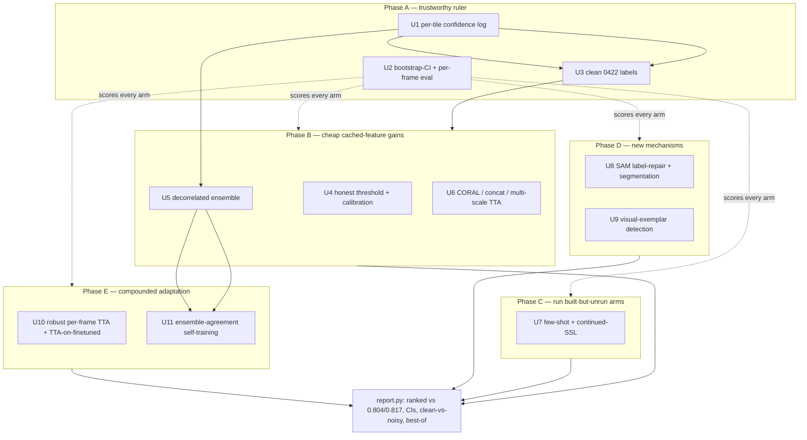

# feat: Stage-2 program — push cross-field cogongrass detection past the baseline on a trustworthy ruler

## Summary

Stage-1 (`arch_sweep`) built the apparatus and showed the current ceiling: aimv2 + LoRA = **0.845**,
aimv2 + EATA = 0.839, both edging the original ~0.84 on the held-out 0422 field. This plan implements
the eight Stage-2 work items (R1–R8) that (a) make the evaluation *trustworthy* and (b) push the number
higher, reusing the existing harness so every new result stays comparable and resume-safe. It is staged:
**foundation → cheap cached-feature gains → run the built-but-unrun arms → new mechanisms → compounded
adaptation.** The governing principle (origin): *fix what we measure against before optimizing against it.*

---

## Problem Frame

The real task is generalizing to a new flight (train 0606 → test entirely held-out 0422; 7,006 tiles,
~28% positive). False negatives are the costly error. Two structural limits remain: the decision boundary
is frozen on 0606, and labels are coarse ("≥30% of a tile inside a YOLO box"; a frame with no box file is
all-negative), so missed annotations become false negatives in the answer key. AUROC ~0.90 with argmax
recall ~0.6 is the fingerprint of label noise, not a weak model — so the measured ~0.84 is likely a
pessimistic floor, and architecture ranking is undecidable without confidence intervals.

---

## Requirements (traceability)

Origin R1–R8 map to the units below. R1→U3, R2→U2, R3→U5, R4→U4, R5→U6, R6→U9, R7→U8, R8→U10/U11.
U1 (per-tile confidence persistence) is a plan-introduced enabler that R1/R3/R8 all depend on. U7 folds in
the origin's "built-but-unrun apparatus" (few-shot, continued-SSL). Program success bar (origin): beat
0.817 with **non-overlapping CIs on the cleaned 0422 set**, without collapsing cogongrass recall; report
recall/F2 at the deployed operating point; keep few-shot in its own table.

---

## Key Technical Decisions

- **KTD1 — Ruler before number.** No win is claimed without bootstrap CIs on the *cleaned* 0422 set.
  Foundation units (U1–U3) land before the cheap-gain tier is read.
- **KTD2 — Single-source the harness; never break resume.** Every new arm emits a `common.ResultRow` via
  the existing atomic writer and is scored by `trainer._make_ok_row`, so all results merge in `report.py`.
  New axes (ensemble, CORAL, calibration, self-train) are encoded in the existing `extra` / `adaptation`
  identity fields — **`IDENTITY_FIELDS` is not changed**, so the 25 existing result rows keep their
  `job_id` and resume still works.
- **KTD3 — Per-tile confidence is the shared substrate.** Persist per-tile `P(cogongrass)` once (U1); label
  cleaning (U3), ensembling (U5), and self-training (U11) all consume it instead of recomputing.
- **KTD4 — Staged elimination.** Cheap cached-feature arms (U4–U6) run before the expensive new-harness
  bets (U8–U9); only configs that clear the bar on the clean ruler advance.
- **KTD5 — Two eval settings never blend.** Label-free adaptation stays `cross_collection`; anything that
  consumes 0422 labels (conformal thresholding, few-shot) is tagged `few_shot` and kept in its own table.
- **KTD6 — External-dep harnesses are isolated and failure-tolerant.** SAM (U8) and visual-exemplar
  detection (U9) live in their own subdirs with their own deps; a load/OOM failure records a row and never
  blocks the rest of the program (mirrors the U3/U11 fit-gate discipline from Stage-1).

---

## High-Level Technical Design

*Directional — shows dependency order and the shared scoring/report seam, not a module spec.*

---

## Implementation Units

### U1. Per-tile confidence persistence (enabler)

- **Goal:** Persist per-tile `P(cogongrass)` for each evaluated cell so label-cleaning, ensembling, and
  self-training consume scores instead of recomputing them.
- **Requirements:** enables R1/R3/R8; KTD3.
- **Dependencies:** none.
- **Files:** `arch_sweep/common.py` (add a scores-sidecar writer/reader), `arch_sweep/trainer.py`
  (emit per-tile scores from `_make_ok_row`/`train_and_eval`), `arch_sweep/tests/test_common.py` (extend).
- **Approach:** Alongside `results/<job_id>.jsonl`, write `results/<job_id>.scores.jsonl` —
  one record per 0422 tile: `path, frame, true_label, p_cogongrass` (the `vlm_zeroshot` ScoreRecord shape,
  ported). Write it through the same atomic temp→fsync→`os.replace` path. Keep it optional/off by a flag so
  tiny unit tests don't require it, on by default for real runs.
- **Patterns to follow:** the atomic writer in `common.write_result_atomic`; the ScoreRecord JSONL pattern
  described in the origin (`vlm_zeroshot`-style `path/frame/true_label/p_cogongrass`).
- **Test scenarios:** round-trip a scores sidecar (write→read identical); sidecar is atomic (no partial file
  on interrupted `os.replace`); a cell with the flag off writes no sidecar; per-tile count == n_test.
- **Verification:** running any `models/train_*.py` produces a `<job_id>.scores.jsonl` with one row per 0422
  tile carrying a `p_cogongrass` in [0,1].

### U2. Frame-level bootstrap CIs + per-frame breakdown

- **Goal:** Give every metric a confidence interval and a per-frame view so wins are decidable.
- **Requirements:** R2; KTD1.
- **Dependencies:** none (reads existing rows; richer with U1).
- **Files:** `arch_sweep/common.py` (`bootstrap_ci`, per-frame aggregation), `arch_sweep/report.py` (render
  CI columns + per-frame summary + clean-vs-noisy dual scores), `arch_sweep/tests/test_common.py`,
  `arch_sweep/tests/test_report.py`.
- **Approach:** Resample **frames** (not tiles — tiles are correlated within a frame, mirroring the
  frame-grouped split) to produce 95% CIs on balanced accuracy / F2. Per-frame metric distribution surfaces
  whether failure is a few bad frames or systematic. Report metrics against raw and cleaned (U3) ground
  truth side by side.
- **Patterns to follow:** `common.frame_of`/`date_of` for frame grouping; existing `f2_sweep` aggregation;
  `report.render` table structure.
- **Test scenarios:** bootstrap CI on a synthetic perfectly-separable set is tight and contains the point
  estimate; on a noisy set the CI widens; resampling is by frame (a frame's tiles move together — assert two
  tiles of one frame never split across a resample); per-frame table lists each frame once; a baseline-vs-cell
  comparison flags "overlapping CIs" vs "separated".
- **Verification:** `report.py` shows a CI column and per-frame view; the win flag requires non-overlapping CIs.

### U3. Label-cleaning pass → cleaned 0422 variant

- **Goal:** Surface and correct suspect 0422 negatives, freeze a `tiles_dataset_0422clean/` eval variant.
- **Requirements:** R1; KTD1/KTD3.
- **Dependencies:** U1 (per-tile confidence), U2 (to measure the lift).
- **Files:** `suspect_negatives.py` / `fp_audit.py` (repoint from legacy 160/1280 to 512/4096 config),
  `arch_sweep/data_variants.py` (register the cleaned variant), `arch_sweep/tests/test_data_variants.py`.
- **Approach:** Rank `not_cogongrass` 0422 tiles by model `P(cogongrass)` (from U1 sidecars, ideally the
  ensemble), review the high-confidence disagreements in `label_tiles.py`, and write a corrected variant.
  Record the count and class flips. Re-score every backbone against the clean variant.
- **Execution note:** characterization-first — snapshot current 0422 class counts before relabeling so the
  diff (how many negatives flip) is auditable.
- **Patterns to follow:** existing `suspect_negatives.py` ranking + `suspect_negatives.csv`; the
  `VariantSpec` / manifest machinery in `data_variants.py`.
- **Test scenarios:** the repointed audit reads 512px tiles without crashing; a synthetic high-confidence
  negative is surfaced as suspect; the cleaned variant is enumerable by `common.py` with corrected counts;
  manifest idempotency holds.
- **Verification:** a `tiles_dataset_0422clean/` variant exists, the number of corrected tiles is recorded,
  and the report shows raw-vs-clean metrics for at least the top backbones.

### U4. Honest operating threshold + calibration

- **Goal:** Stop reporting only argmax; apply the 0606-fit threshold and report recall/F2 at the deployed point.
- **Requirements:** R4; KTD5.
- **Dependencies:** U2 (CIs to read it honestly).
- **Files:** `arch_sweep/trainer.py` (scoring tail), `arch_sweep/common.py` (temperature scaling,
  prior-matching helpers), `arch_sweep/tests/test_trainer.py`.
- **Approach:** Add an `eval_threshold` policy: keep argmax `balanced_accuracy` for baseline comparability,
  but additionally report recall/F2 at (a) the recorded 0606 F2-threshold, and (b) a label-free
  **prior-matched** threshold (predicted positive fraction = known prevalence). Add temperature scaling fit
  on 0606 and AdaBN score alignment on 0422. Label-dependent **conformal** FN-rate control routes through the
  `few_shot` track (KTD5).
- **Patterns to follow:** `common.pick_threshold_on` / `f2_sweep`; the AdaBN path in `tta.py`.
- **Test scenarios:** prior-matching picks a threshold whose predicted-positive fraction ≈ the supplied prior
  on synthetic scores; temperature scaling is monotonic (preserves AUROC, changes calibration); the
  prior-matched path reads no 0422 labels (assert); conformal path is tagged `few_shot`.
- **Verification:** a cell reports cogongrass recall/F2 at the deployed threshold with a measurable FN drop
  vs argmax, while the headline stays an honest cross-collection number.

### U5. Decorrelated backbone ensemble

- **Goal:** Average per-tile probabilities across the top backbones, frozen and EATA-adapted.
- **Requirements:** R3; KTD2/KTD3.
- **Dependencies:** U1 (per-tile scores), U4 (threshold), benefits from U6.
- **Files:** `arch_sweep/models/ensemble.py` (new), `arch_sweep/tests/test_ensemble.py`.
- **Approach:** Load cached features for siglip2/aimv2/cradio/dinov3_sat via `features.load_features`, align
  rows by the stored `paths`, train each head with `trainer.train_head`, optionally `tta.adapt_head` per
  member, average per-tile probs, then call `trainer._make_ok_row` so it scores identically. Emit one
  `ResultRow` with `extra="ensemble=..."`. Add a within-backbone seed-soup option (average head weights over
  seeds) for free variance reduction.
- **Patterns to follow:** `trainer._train_frozen` + `_make_ok_row`; `features.load_features` provenance.
- **Test scenarios:** row alignment by `paths` (mismatched order is detected, not silently averaged); a
  2-member ensemble of decorrelated synthetic heads scores ≥ the best member on a separable set; output row
  has distinct `job_id` and `eval_setting=cross_collection`; EATA-tier ensemble runs.
- **Verification:** an ensemble row appears in the report, scored against the best single member with CIs.

### U6. Domain-alignment stack — CORAL · concat · multi-scale/flip TTA

- **Goal:** Three label-free levers off the cached features that stack with U4/U5.
- **Requirements:** R5.
- **Dependencies:** U1; composes with U5.
- **Files:** `arch_sweep/trainer.py` (CORAL preprocessing under `adaptation="coral"`),
  `arch_sweep/models/ensemble.py` (early-fusion concat option), `arch_sweep/data_variants.py` (flip/scale
  view variants), `arch_sweep/tests/test_trainer.py`.
- **Approach:** **CORAL** — whiten 0606 features, re-color to 0422 second-order stats (label-free, uses the
  cached 0422 feature matrix), train the head on aligned features. **Concat** — early-fusion of 2–4 backbones'
  features into one BN head (L2-normalize each block first). **Multi-scale/flip** — cache extra views per
  backbone, average head probs.
- **Patterns to follow:** the `X[te_idx]` target-feature slice already in `_train_frozen`; per-(backbone,
  variant) cache keying in `features.py`.
- **Test scenarios:** CORAL transform aligns source covariance to target on synthetic features (Frobenius
  distance drops); CORAL reads no labels; concat head input dim = sum of member dims and trains; flip-view
  averaging preserves shape; each emits a comparable row with a distinct identity tag.
- **Verification:** CORAL / concat / multi-scale rows appear, best stack identified with CIs.

### U7. Run the built-but-unrun arms — few-shot + continued-SSL

- **Goal:** Execute and integrate the Stage-1 apparatus that was built but never run.
- **Requirements:** origin "deferred apparatus"; R4 conformal hook; KTD5.
- **Dependencies:** U1, U2.
- **Files:** `arch_sweep/fewshot.py` (wire a runnable entry + report integration), `arch_sweep/report.py`
  (few-shot table already separate — confirm rows land), `arch_sweep/continued_ssl.py` /
  `arch_sweep/models/train_dinov3_ssl.py` (run the tiny-step smoke then the real SSL pretrain), tests as
  needed.
- **Approach:** Run the few-shot adapters (prototype/Tip/Soup + active learning) across budgets on the top
  backbones' cached 0422 features → `few_shot` table. Run the continued-SSL smoke (few hundred tiles, 1 epoch)
  to confirm the atomic-checkpoint round-trip, then the real pretrain → evaluate `dinov3_ssl` as a normal cell.
- **Execution note:** SSL — run the tiny smoke first (origin U9 execution note) before the multi-hour run.
- **Patterns to follow:** `fewshot.run_fewshot`; `continued_ssl.run_ssl` + `load_ssl_backbone`.
- **Test scenarios:** few-shot rows are tagged `few_shot` with budget and excluded from the cross table;
  budget/eval frames disjoint (already covered — confirm at integration); SSL smoke writes a loadable
  checkpoint; `train_dinov3_ssl` emits a cross_collection row.
- **Verification:** the report shows a populated few-shot table and a `dinov3_ssl` cross-collection row.

### U8. SAM label-repair + segmentation/coverage eval

- **Goal:** Tighten labels with SAM masks (lifts every track) and add a segmentation/coverage reframe.
- **Requirements:** R7; KTD6.
- **Dependencies:** U2 (to measure label-repair lift); independent of U4–U6.
- **Files:** `arch_sweep/sam/` (new isolated subdir: mask generation, box∩mask label repair, region/pixel
  eval), reuse root `sam_explore.py`, `arch_sweep/tests/test_sam.py`.
- **Approach:** (a) Offline label repair — intersect each YOLO box with SAM2/SAM-3 masks so a tile is positive
  only where grass pixels fall, producing a cleaner-label variant; report the lift it gives the 0.817 baseline
  when retrained. (b) Deploy reframe — segment → classify region (texture / exemplar embedding) → pixel
  coverage; collapse masks to per-tile labels for the standard metric, plus pixel IoU / coverage-MAE.
- **Execution note:** fit-gate first — confirm SAM2-large/SAM-3 loads on the GB10 (the old card forced
  SAM2-tiny) before the full pass.
- **Patterns to follow:** root `sam_explore.py`; the variant + report seam.
- **Test scenarios:** box∩mask repair changes the positive set on a synthetic box+mask fixture; repaired
  variant is enumerable; collapsed-to-tile predictions score on the standard protocol; coverage-MAE computed;
  a SAM load failure records a row and does not abort.
- **Verification:** a repaired-label variant + its baseline lift, and a segmentation cell reporting tile
  metrics + coverage-MAE.

### U9. Visual-exemplar promptable detection

- **Goal:** Evaluate a detector that re-anchors per field from a few exemplars (the one mechanism that adapts
  rather than freezing a boundary).
- **Requirements:** R6; KTD6.
- **Dependencies:** U2 (scoring); independent of the cached-feature arms.
- **Files:** `arch_sweep/detect/` (new isolated subdir: detector loader, exemplar prompting, rasterize→tile),
  `arch_sweep/tests/test_detect.py`.
- **Approach:** Load an open-vocab / visual-prompt detector (T-Rex2, with T-Rex-Omni negative exemplars for
  look-alike grasses), prompt with a few 0422 cogongrass boxes, detect across 0422 frames, rasterize boxes
  onto the 512px tile grid → per-tile predictions → identical metrics. Sweep detector confidence for the F2
  curve. Assess the diffuse-texture / oblique-view risk explicitly.
- **Execution note:** fit-gate the detector load on the GB10 first.
- **Patterns to follow:** the tile grid in `data_variants.tile_records`; `common` metrics.
- **Test scenarios:** rasterize a synthetic detection box onto the tile grid → correct positive tiles;
  confidence sweep yields the F2 table; per-tile predictions score on the standard 0422 protocol; detector
  load failure records a row, doesn't abort.
- **Verification:** a detection cell reports balanced accuracy / recall / AUROC on 0422 with a verdict on
  whether per-field re-anchoring beats frozen+TTA.

### U10. Robust per-frame TTA + TTA on the fine-tuned path

- **Goal:** Make TTA deployment-real (per-frame) and let it compound with fine-tuning.
- **Requirements:** R8 (a/b); KTD5.
- **Dependencies:** U1; builds on the existing `tta.py`.
- **Files:** `arch_sweep/tta.py` (add `sar`, `cotta`, episodic per-frame mode), `arch_sweep/trainer.py`
  (call `adapt_head` on the fine-tuned path), `arch_sweep/tests/test_tta.py`.
- **Approach:** Add SAR (sharpness-aware + reliable-sample filter) and CoTTA (weight-averaged teacher) as
  siblings of the existing methods; add an **episodic per-frame** mode that resets BN state per source frame
  (matching `heatmap_infer.py`). Enable TTA on `_train_finetune` (LoRA+EATA) — currently only the frozen path
  adapts. New methods/modes are new `adaptation` values → distinct `job_id`s.
- **Patterns to follow:** existing `tta.adapt_head` dispatch; the frozen TTA wiring in `_train_frozen`.
- **Test scenarios:** SAR/CoTTA touch only BN affine (backbone frozen); episodic per-frame mode does not
  collapse on an imbalanced single-frame synthetic stream; LoRA+EATA emits a row (`mode=lora,
  adaptation=eata`); methods registered in `METHODS`.
- **Verification:** per-frame heatmap stability shown (no one-class collapse); a verdict on whether
  fine-tune+TTA compounds beyond U5/U6.

### U11. Ensemble-agreement pseudo-label self-training

- **Goal:** Learn target appearance from confident, ensemble-agreed 0422 pseudo-labels.
- **Requirements:** R8 (c); KTD5.
- **Dependencies:** U5 (ensemble), U1.
- **Files:** `arch_sweep/models/selftrain.py` (new), `arch_sweep/tests/test_selftrain.py`.
- **Approach:** Score 0422 with the U5 ensemble; add tiles where ≥3/4 backbones agree at high confidence to
  the 0606 training pool; retrain heads off cache; iterate 2–3 rounds, capping pseudo-positives to the prior.
  Target data enters only via its own predictions; **test frames are strictly held out** of any pseudo-label
  pool (protocol preservation).
- **Patterns to follow:** `trainer.train_head`; the frame-grouped split in `common` to fence off test frames.
- **Test scenarios:** pseudo-labeled frames never include test frames (assert disjoint); only ≥3/4 high-conf
  tiles are added; a round on a separable synthetic set is non-decreasing; capped to prior; tagged
  `extra="pseudo=agree3"`, still `cross_collection` but visually separated in the report.
- **Verification:** a self-trained cell with a clear verdict on whether it compounds beyond U5.

---

## Scope Boundaries

### Deferred to Follow-Up Work
- Bi-temporal **change detection** — blocked by data (0606 and 0422 are different fields, not repeat
  flights); needs a same-field revisit first.
- A weed-specific foundation backbone (e.g. WeedNet) — at most one extra tournament slot, not a program item.
- Production / deployment packaging — this program measures and selects.

### Rejected (carried from origin, with reason)
- **VLM as the classifier** — falsified (≈ chance); VLMs only as offline label-cleaners (U3).
- **One-class / novelty detection** — cogongrass is ~28% of tiles, not rare; allowed only as a re-ranking
  layer, not a detector.
- **Naïve single-model self-training** — confirmation bias; only the ensemble-agreement form (U11) survives.

---

## Dependencies & Assumptions

- Single-tenant GB10 (~120 GB unified memory; `nvidia-smi` memory reads N/A — use `free -h`). Stop other GPU
  tenants before heavy runs. Cached features make U4–U6 CPU-cheap; the compute bottleneck is fine-tune/SSL/SAM.
- The audit scripts (`suspect_negatives.py`, `fp_audit.py`, `neighbor_analysis.py`) hardcode the legacy
  160px/1280-prep config and must be repointed to 512/4096 before U3 (verified: they predate the full-res pipeline).
- U3 needs a bounded human relabeling pass on flagged 0422 frames.
- U8/U9 add external deps (SAM2/SAM-3; T-Rex2 or equivalent) — isolated, fit-gated, failure-tolerant (KTD6).
- `IDENTITY_FIELDS` stays fixed so the 25 existing result rows keep their `job_id` (resume safety).

---

## Open Questions (resolve at implementation / run time)

- Relabeling budget + confidence cutoff for U3 (`suspect_negatives.py SUSPECT` threshold).
- The "material win" CI-separation margin over 0.817 once Stage-1-with-CIs spread is visible.
- Whether U8's segmentation reports coverage-MAE as primary or stays bridged to tile accuracy.
- U9 detector + prompt strategy (optimal plant prompts diverge from species names) — settle empirically.
- Active-learning budget sizes to sweep in U7.

---

## Sources & Research

Origin requirements: `docs/brainstorms/2026-06-26-cogongrass-stage2-program-requirements.md`.
Ideation + external method scan: `docs/ideation/2026-06-26-002-whats-next-cogongrass-cross-field.html`.
Existing apparatus + patterns: `arch_sweep/` (`common.py`, `trainer.py`, `tta.py`, `report.py`,
`features.py`, `fewshot.py`, `continued_ssl.py`, `data_variants.py`, `run_all.py`); root `sam_explore.py`,
`suspect_negatives.py`, `fp_audit.py`, `neighbor_analysis.py`, `heatmap_infer.py`; Stage-1 plan
`docs/plans/2026-06-26-001-feat-arch-sweep-traditional-ml-plan.md`.
