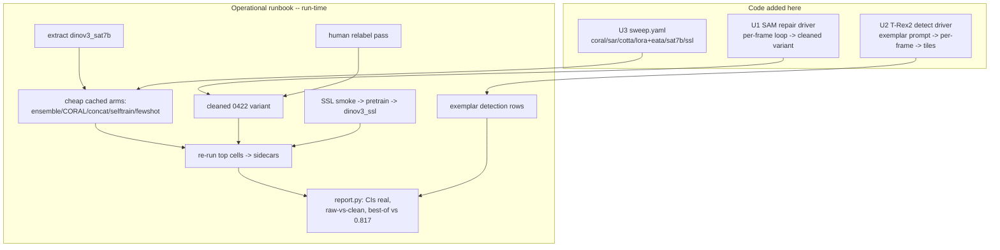

# feat: Finish Stage-2 — last-mile drivers + the run-time runbook that fills the results

## Summary

The Stage-2 program (`2026-06-27-001`) landed all 11 units' CPU-testable apparatus — 162 tests
green, one commit per unit. Two things remain before the program produces *numbers* instead of
*machinery*: (1) two **last-mile driver scripts** the original plan deferred to run time because
they need an external model present to run or test — the SAM per-frame label-repair loop (U8) and
the T-Rex2 exemplar-detection loop (U9) — and (2) the **ordered run-time runbook** that actually
extracts the missing backbone, runs the cheap cached-feature arms, fit-gates and runs the external
models, pretrains SSL, drives the human label-cleaning pass, and re-runs the top cells so U2's
confidence intervals become real. Governing principle (carried from the origin): *the apparatus is
single-sourced and resume-safe; the only code added here is the thin model-driving glue, and every
run emits a `common.ResultRow` that merges into the same report.*

---

## Problem Frame

Stage-2 deliberately separated **writeable-and-testable-without-the-GPU** (done) from
**needs-the-model-present** (deferred). What's left is exactly that second set, plus the executions
that were always run-time:

- **U8 SAM** has the tested geometry (`box_intersect_mask`, `repair_tile_labels`, `coverage_mae`,
  `pixel_iou`) and a failure-tolerant fit gate, but **no per-frame loop** that loads SAM, generates
  masks over every 0422 frame, and materializes `tiles_dataset_0422clean/`.
- **U9 detect** has the tested rasterize→tile geometry and F2 sweep, but `load_detector()` is an
  explicit `NotImplementedError` and there is **no per-frame detection loop**.
- **No results exist yet** for any Stage-2 arm: the ensemble (U5), CORAL/concat/views (U6),
  self-training (U11), few-shot (U7), the new TTA methods `sar`/`cotta` and CORAL/LoRA+EATA cells
  (U6/U10), the un-run backbone `dinov3_sat7b`, and the continued-SSL backbone `dinov3_ssl` (U7).
- The 26 existing rows **predate U1**, so they carry no per-tile score sidecars → the report shows
  `—` for every CI. U2's "wins require non-overlapping CIs" rule is inert until cells are re-run.

False negatives remain the costly error; balanced accuracy + per-class recall + frame-resampled
CIs remain the ruler (CLAUDE.md, origin KTD1).

---

## Requirements (traceability)

This plan closes the two code gaps and executes the program. Mapping to origin Stage-2 units:

- **U8 last mile** → U1 (SAM repair driver).
- **U9 last mile + deferred detector choice** → U2 (T-Rex2 / T-Rex-Omni driver).
- **Backbone-level new cells** (CORAL, `sar`, `cotta`, LoRA+EATA, `dinov3_sat7b`) → U3 (sweep config).
- **All run-time executions** (extraction, cheap arms, fit-gates, SSL, human relabel, CI backfill)
  → the **Operational Runbook** section, ordered and verifiable.

Program success bar is unchanged (origin): beat 0.817 with **non-overlapping CIs on the cleaned
0422 set**, without collapsing cogongrass recall; report recall/F2 at the deployed point; keep
few-shot and exemplar-detection in their own table.

---

## Key Technical Decisions

- **KTD1 — Glue only; the engines are frozen.** U1/U2 are thin drivers over already-tested functions
  (`sam/repair.py`, `detect/exemplar.py`). They add a per-frame loop and a `main()`, nothing more.
  The pure geometry is not reopened.
- **KTD2 — Drivers stay failure-tolerant (origin KTD6).** Every driver routes through the existing
  fit gate first (`run_sam_smoke` / `run_detect_smoke`); a load/OOM failure records a row and the
  driver exits cleanly rather than crashing a long run.
- **KTD3 — Mechanism arms run via their own `main()`, not `run_all.py`.** `run_all.py` enumerates
  `train_<model>.py` backbone jobs. The ensemble/self-train/few-shot/SAM/detect arms are *not*
  backbone scripts, so they are invoked directly (each already has a `main()`). Only backbone-level
  cells (CORAL/`sar`/`cotta`/LoRA+EATA/`dinov3_sat7b`/`dinov3_ssl`) go in `configs/sweep.yaml`.
- **KTD4 — CIs come from re-running, not back-filling.** A score sidecar needs per-tile probabilities
  the old rows never stored. The only way to populate CIs for a cell is to re-run it (sidecars are
  now default-on in `run_cli`). The runbook re-runs the top contenders rather than inventing a
  fake-sidecar shim.
- **KTD5 — Cleaned ruler before the headline read.** SAM repair (U1) + the human label-cleaning pass
  (origin U3) land before the final "did we beat 0.817" report is trusted, per origin KTD1.

---

## High-Level Technical Design

*Directional — dependency order and the report seam, not a module spec.*

---

## Implementation Units

### U1. SAM per-frame label-repair driver

- **Goal:** Drive the tested SAM geometry over every 0422 frame to produce the repaired-label
  variant `tiles_dataset_0422clean/` and report the per-tile flip count.
- **Requirements:** completes origin U8; KTD1/KTD2/KTD5.
- **Dependencies:** none (uses shipped `sam/repair.py`, `data_variants.boxes_mask`,
  `data_variants.build_clean_variant`).
- **Files:** `arch_sweep/sam/run_repair.py` (new driver + `main()`),
  `arch_sweep/tests/test_sam_driver.py` (new).
- **Approach:** Fit-gate first (`run_sam_smoke`); on success, loop the 0422 frames in
  `drone_dataset/images`: build the YOLO box mask (`data_variants.boxes_mask`), generate SAM masks
  (`sam_masks_for_image`), intersect + collapse to tiles (`repair_tile_labels`), accumulate the
  flip map (`relabel_map_from_repairs`), then `build_clean_variant(relabel)`. Record total flips and
  per-frame coverage-MAE. Keep the frame loop injectable (a `mask_fn` seam) so the accumulation is
  testable without SAM. Segmentation/coverage eval (collapse masks → tile metrics + coverage-MAE)
  is a reporting tail over the same loop.
- **Execution note:** fit-gate `sam2_l` (or SAM-3) on the GB10 before the full pass; step down to
  `sam2_b`/`sam2_t` on OOM (the gate records which).
- **Patterns to follow:** `sam/repair.py` (all the geometry), `data_variants.boxes_mask` for the box
  mask, `data_variants.build_clean_variant` for materialization, root `sam_explore.py` for the SAM
  call shape.
- **Test scenarios:**
  - Happy path: a 2-frame injected fixture (box masks + stub SAM masks) accumulates the correct
    relabel map and reports the expected flip count.
  - Edge: a frame whose box∩mask is empty flips all its box-positive tiles to negative; a frame with
    full grass coverage flips nothing.
  - Error path: the fit gate failing (injected broken loader) records a `failed`/`oom` row and the
    driver returns without raising or writing a variant.
  - Integration: the accumulated relabel map drives `build_clean_variant` to an enumerable
    `tiles_dataset_0422clean/` whose class counts match the flips (reuses the U3 build path).
- **Verification:** running the driver on the real frames produces `tiles_dataset_0422clean/`, prints
  the flip count and mean coverage-MAE, and a fit-gate failure leaves a recorded row + no partial
  variant.

### U2. T-Rex2 / T-Rex-Omni exemplar-detection driver

- **Goal:** Wire the concrete detector loader and drive exemplar-prompted detection over the 0422
  frames into per-tile predictions scored on the standard protocol.
- **Requirements:** completes origin U9 and resolves its deferred detector choice; KTD1/KTD2.
- **Dependencies:** none (uses shipped `detect/exemplar.py`).
- **Files:** `arch_sweep/detect/trex.py` (new — concrete T-Rex2 loader + T-Rex-Omni negative-exemplar
  prompting), `arch_sweep/detect/run_detect.py` (new driver + `main()`),
  `arch_sweep/detect/exemplar.py` (point `load_detector` at the `trex` loader),
  `arch_sweep/tests/test_detect_driver.py` (new).
- **Approach:** Replace the `load_detector` `NotImplementedError` with a thin call into `trex.py`
  (lazy import so the dep only loads on a real run). Fit-gate via `run_detect_smoke`. On success:
  prompt with a few 0422 cogongrass exemplar boxes (+ T-Rex-Omni negative exemplars for look-alike
  grasses), detect across 0422 frames, rasterize each frame's boxes to the 512px tile grid
  (`tile_records_from_boxes`), concatenate, and score with `run_detection` (tagged `few_shot` —
  exemplars are 0422 labels, KTD5). Sweep detector confidence for the F2 curve. Assess the
  diffuse-texture / oblique-view risk explicitly from the resulting curve.
- **Execution note:** fit-gate the T-Rex2 load on the GB10 before the full pass; the exemplar set and
  prompt phrasing are tuned empirically (origin open question).
- **Patterns to follow:** `detect/exemplar.py` (rasterization, sweep, `run_detection`), the
  failure-tolerant gate in `sam/repair.run_sam_smoke`.
- **Test scenarios:**
  - Happy path: an injected detector stub returning fixed boxes over a 2-frame fixture produces the
    correct per-tile predictions and a populated F2 sweep.
  - Edge: a frame with zero detections yields all-negative tiles; the exemplar count is recorded as
    `budget`.
  - Error path: the fit gate failing (injected broken loader) records a row and the driver exits
    without raising.
  - Integration: the concatenated per-frame predictions score through `run_detection` to a
    `few_shot` row with balanced accuracy / recall / AUROC and a scores sidecar.
- **Verification:** the driver loads T-Rex2 (or records a clean failure), and on success emits a
  `few_shot` detection row on 0422 with a verdict on whether per-field re-anchoring beats frozen+TTA.

### U3. Extend the sweep config with the new backbone-level cells

- **Goal:** Add the Stage-2 backbone-level cells that route through `run_all.py` so they run with one
  command and resume-skip what exists.
- **Requirements:** schedules origin U6 (CORAL), U10 (`sar`/`cotta`, LoRA+EATA), and the un-run
  `dinov3_sat7b` / `dinov3_ssl` backbones.
- **Dependencies:** `dinov3_sat7b` features extracted (runbook step 1); `dinov3_ssl` checkpoint
  (runbook step 5) before its cell is uncommented.
- **Files:** `arch_sweep/configs/sweep.yaml` (extend the job matrix).
- **Approach:** Add cells reusing the existing list-cross-product syntax: CORAL on the frozen winners
  (`adaptation: coral`), the new TTA siblings (`adaptation: [sar, cotta]` on siglip2/aimv2/cradio/
  dinov3_sat), LoRA+EATA (`tuning_mode: lora, adaptation: eata` on the top backbone — now that U10
  lets the FT path adapt), `dinov3_sat7b` frozen + TTA, and uncomment the `dinov3_ssl` cell once its
  checkpoint exists. Backbone-level only — the mechanism arms (ensemble/self-train/few-shot/SAM/
  detect) are invoked by their own `main()` per KTD3.
- **Patterns to follow:** the existing Stage-1/Stage-2 entries and commented templates in
  `configs/sweep.yaml`; `run_all.enumerate_jobs` cross-product expansion.
- **Test scenarios:** `Test expectation: none` — pure config. Verify via `run_all.py --dry-run`
  that the new cells enumerate to distinct `job_id`s and that existing cells still resume-skip.
- **Verification:** `python arch_sweep/run_all.py --dry-run` lists the new CORAL/`sar`/`cotta`/
  LoRA+EATA/`dinov3_sat7b` cells; a real run produces their rows; the report ranks them with CIs.

---

## Operational Runbook (run-time execution order)

Ordered so each step's inputs exist; every step is resume-safe (existing `results/<job_id>.jsonl`
skip) and emits rows that merge in `report.py`. Cached-feature steps are CPU-cheap (minutes); the
GPU bottleneck is extraction, fine-tune, SSL, SAM, and detection. Stop other GPU tenants before the
heavy steps (`free -h`, not `nvidia-smi`, on the GB10).

1. **Extract the missing backbone.** Fit-gate then full-extract `dinov3_sat7b`:
   `features.py --backbone dinov3_sat7b --variant reference --limit 16`, then without `--limit`.
   *Done when* `results/features/dinov3_sat7b__reference.npz` exists.
2. **Run the cheap cached-feature arms** (all on already-cached features):
   - `models/ensemble.py` (frozen, then `--adaptation eata`, then `--seed-soup`)
   - `models/ensemble.py` concat via `run_concat` (CLI flag or a one-liner)
   - `models/selftrain.py --rounds 3 --agree-k 3`
   - `fewshot.py --model <top backbones>` (separate few_shot table)
   - `run_all.py` for the U3 sweep additions (CORAL, `sar`, `cotta`, LoRA+EATA, `dinov3_sat7b`)
   *Done when* the report shows ensemble/CORAL/concat/self-train rows and a populated few-shot table.
3. **SAM label-repair (U1).** Fit-gate, then run `sam/run_repair.py` → `tiles_dataset_0422clean/`;
   re-score the top backbones against `--variant reference_0422clean`. *Done when* the report's
   raw-vs-clean column is populated for the top cells and the flip count is recorded.
4. **Human label-cleaning pass (origin U3).** Rank with the repointed `suspect_negatives.py`
   (512/4096) and/or the U1 ensemble sidecars, review high-confidence disagreements in
   `label_tiles.py`, fold corrections into `build_clean_variant`. *Done when* the corrected-tile
   count is recorded and merged into `tiles_dataset_0422clean/`.
5. **Continued-SSL (U7).** `continued_ssl.py --smoke` (tiny-step gate), then the real pretrain, then
   uncomment the `dinov3_ssl` cell (U3) / run `models/train_dinov3_ssl.py`. *Done when* a
   `dinov3_ssl` cross-collection row appears.
6. **Exemplar detection (U2).** Fit-gate T-Rex2, then run `detect/run_detect.py`. *Done when* a
   `few_shot` detection row appears with its F2 curve and oblique-view verdict.
7. **Backfill CIs (KTD4).** Re-run the top ~6 cross-collection contenders (sidecars are now default
   in `run_cli`) so each writes `<job_id>.scores.jsonl`. *Done when* the report shows real 95% CIs
   for the contenders instead of `—`.
8. **Final read.** `report.py` → ranked cross table with CIs, raw-vs-clean, separate few-shot/
   detection table, best-of vs 0.817. *Done when* a win is claimed only with a CI-separated,
   recall-uncollapsed cell on the cleaned ruler.

---

## Scope Boundaries

### Deferred to Follow-Up Work
- A one-command Stage-2 orchestration harness wiring the mechanism arms (ensemble/self-train/
  few-shot/SAM/detect) into a single runner — deliberately not built (KTD3); they run via their own
  `main()`. Revisit only if the runbook proves too manual.
- Bi-temporal change detection, a weed-specific foundation backbone, and production packaging —
  carried forward from the origin's deferred list, unchanged.

### Rejected (carried from origin)
- VLM as classifier (falsified); naïve single-model self-training (confirmation bias); one-class
  detection (cogongrass ~28%, not rare). Only the surviving forms are in scope.

---

## Open Questions (resolve at run time)

- SAM model that fits + produces useful grass masks on the GB10 (`sam2_l` vs SAM-3 vs step-down) —
  settle at the U1 fit gate.
- T-Rex2 exemplar set + prompt phrasing (optimal plant prompts diverge from species names) — settle
  empirically at the U2 run (origin open question).
- Whether U8's segmentation half reports coverage-MAE as the primary metric or stays bridged to tile
  accuracy (origin open question).
- The "material win" CI-separation margin over 0.817, once Stage-1-with-CIs spread is visible after
  step 7.
- Relabeling budget + `SUSPECT` confidence cutoff for the human pass (step 4).

---

## Sources & Research

Origin plan: `docs/plans/2026-06-27-001-feat-cogongrass-stage2-program-plan.md` (all 11 units shipped,
162 tests). Shipped apparatus this plan drives: `arch_sweep/sam/repair.py`, `arch_sweep/detect/
exemplar.py`, `arch_sweep/models/ensemble.py`, `arch_sweep/models/selftrain.py`, `arch_sweep/
fewshot.py`, `arch_sweep/continued_ssl.py`, `arch_sweep/data_variants.py`, `arch_sweep/run_all.py`,
`arch_sweep/configs/sweep.yaml`; root `sam_explore.py`, `suspect_negatives.py`, `label_tiles.py`.
GB10 runtime: memory `gb10-torch-runtime`; HF cache `spark-hf-cache-root-owned`.
