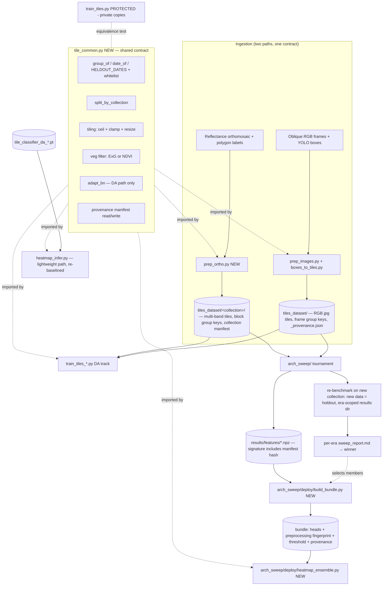

# refactor: Pipeline audit, deployable consolidation, and multispectral readiness

## Summary

Harden the tile-classifier pipeline end to end: centralize the copy-pasted identity/split/tiling logic into one shared module, flip the silent-downscale defaults to the full-res values, remove dead artifacts, package the arch-sweep winner (frozen aimv2+cradio+siglip2+dinov3_sat ensemble + EATA, 0.862 balanced accuracy) into an immutable deploy bundle with a new ensemble heatmap path, and make ingestion ready for the Mavic 3M's nadir reflectance orthomosaics with 4-band multispectral tiles, polygon labels, and spatial-block leakage keys — without breaking the existing oblique-RGB path or the protected baseline. The architecture sweep is retained as a **standing benchmark**: every new collection can re-run all backbones/methods against it in an era-scoped results space, and the deploy bundle is built from whichever architecture the latest benchmark declares the winner.

---

## Problem Frame

The pipeline is a set of directory-coupled scripts whose handoffs depend on conventions rather than code. Three pressures now converge on it:

1. **Drift and hazard.** The tile identity contract (`DJI_<date>..._r<row>_c<col>` filenames) drives splitting, leakage prevention, bootstrap CIs, and per-frame TTA, and is copy-pasted into 6+ files. Tiling geometry already diverged between training (ceil grid, clamped partial edge crops) and inference (floor grid, drops edges). Script defaults still silently downscale (`PREP_MAX=1280`, `TILE_PX=160`) unless env overrides are remembered, and `label_tiles.py` hardcodes a 160px grid against a 512px pipeline. On top of that, several stages can silently destroy expensive artifacts: `boxes_to_tiles.py` wipes all 46k tiles on every run and overwrites human-corrected labels, and the arch-sweep feature cache cannot detect pixel changes under unchanged filenames.
2. **The best model can't deploy.** The arch sweep found a CI-separated winner — `ensemble=aimv2+cradio+siglip2+dinov3_sat · frozen · mlp_bn · eata` at 0.862 balanced accuracy (95% CI [0.848, 0.874], record `arch_sweep/results/e9538acbe403bfc7.jsonl`) — but the sweep never saves trained heads, and `heatmap_infer.py` can only load a single ResNet18 checkpoint. The winner exists only as a metric row.
3. **The data is about to change shape.** The collection protocol (see origin context: `docs/brainstorms/2026-06-29-drone-data-collection-protocol-requirements.md`) pivots to nadir RGB + 4-band multispectral on the Mavic 3M, reflectance-calibrated and stitched to orthomosaics with map-drawn polygon labels. Every current stage hard-assumes 3-channel oblique RGB JPEG, ExG filtering, YOLO-box labels, and DJI per-frame filenames. A new collection date would today silently enter the *training* pool because the held-out date is hardcoded to `20260422`.

The refactor and the nadir readiness are not two projects: they meet at the filename-encoded identity contract. Designing the generalized group/date key first, proving it equivalent to the protected baseline, and building orthomosaic ingestion on top of it is the load-bearing sequencing decision of this plan.

---

## Requirements

**Shared contract & connectivity**

- R1. One shared module owns tile identity (group key), collection-date parsing, the cross-collection split, tiling geometry, the vegetation filter, and the DA path's AdaBN; every non-protected consumer imports it instead of carrying a private copy.
- R2. `train_tiles.py` and `tile_classifier.pt` are not modified; an automated equivalence test asserts the shared module's split output matches the baseline's — on the live DJI-only dataset *and* on a mixed oblique+ortho fixture — so drift is caught instead of prevented by duplication.
- R3. Full-res values (`PREP_MAX=4096`, `TILE_PX=512`, `TILE_SAVE_PX=512`) become the script defaults; `label_tiles.py`'s grid follows the tile-label JSON's recorded tile size on read *and* write.
- R4. The held-out collection is a parameter (default `["20260422"]`, preserving all current numbers); frames whose date doesn't parse raise an error unless whitelisted, with the 14 existing non-DJI stems pre-seeded so current train-pool membership reproduces exactly.
- R5. Tiling geometry is identical between training and inference: ceil grid with clamped partial edge crops resized to model input (training's actual rule — no zero-padding).

**Data safety**

- R6. `tiles_dataset/` carries an atomically-written provenance manifest (`TILE_PX`, `TILE_SAVE_PX`, `PREP_MAX`, JPEG quality, veg threshold, source content digest, git state); the feature-cache signature incorporates it, so pixel drift under unchanged filenames raises `StaleFeatureCache` instead of silently reusing stale features.
- R7. `boxes_to_tiles.py` refuses to wipe an existing dataset whose provenance differs from the requested parameters unless explicitly forced; orthomosaic collections live in a namespace the oblique wipe cannot reach.
- R8. Human-edited tile labels survive `boxes_to_tiles.py` re-runs (bootstrap labels write to a distinct namespace or skip provenance-marked human edits).
- R9. `prep_images.py` errors on frame-stem collisions across intake folders; a retile over mixed-resolution source frames is flagged via provenance, not silently blended.

**Dead code**

- R10. Dead artifacts are removed and `.gitignore` updated so regenerable outputs stop lingering; the intentional diagnostics (`leakage_check.py`, `fp_audit.py`, `suspect_negatives.py`, `isolated_fp_viz.py`, `neighbor_analysis.py`) are retained. `tiles_dataset.zip` is deleted only after the full-res retile is verified (it is the rollback snapshot until then).

**Deployable consolidation**

- R11. A one-time builder serializes the winning ensemble into an immutable deploy bundle — head weights, backbone identifiers, a preprocessing fingerprint (library versions + resolved per-member transform hash), member list, averaging rule, decision threshold with its fit scores, and provenance (feature signature, tiling-manifest hash, git sha + dirty flag) — plus pre-calibrated fallback bundles. Multi-bundle builds are all-or-nothing.
- R12. A new ensemble inference script runs a bundle end to end on a folder of frames: per-backbone preprocessing (fingerprint-verified against the bundle), feature-space batch EATA over all provided tiles, probability averaging, the bundle's fit threshold, heatmap render. A missing member or fingerprint mismatch is a hard failure, never an ad-hoc drop.
- R13. Bundle building re-scores against the cached 0422 features and records the achieved balanced accuracy next to the 0.862 reference; it refuses to emit below the CI floor (0.848) without an explicit override.

**Multispectral / nadir readiness**

- R14. Orthomosaic ingestion: a reflectance orthomosaic + polygon labels produce tiles carrying a spatial-block group key, reusing the existing ≥30%-cover labeling rule against a rasterized polygon mask.
- R15. Multispectral tiles are stored losslessly (multi-band, 16-bit-capable — never JPEG); a per-collection manifest binds RGB view ↔ multi-band array ↔ per-band normalization stats with a content hash, and a consistency check detects desync. Frozen RGB backbones consume a derived 3-channel RGB view.
- R16. The vegetation filter is band-aware: ExG for RGB tiles, NDVI for tiles with a NIR band.
- R17. The oblique-RGB path remains fully functional; oblique and orthomosaic collections can coexist in one dataset and one training run, with normalization stats scoped per collection.

**Standing architecture benchmark**

- R19. All sweep architectures (the full backbone/method/adaptation grid in `arch_sweep/`) are retained as a standing benchmark; ingesting a new collection can re-run the full sweep against it, with the new collection designated as the held-out target.
- R20. Sweep results are era-scoped: a re-run on changed data writes to its own results space (keyed by dataset provenance + holdout designation) so resume-skip never serves stale rows, prior eras remain intact for cross-era comparison, and each era renders its own report.
- R21. The bundle builder selects members from a named sweep report's winning rows (the current era's winner by default, current hardcoded winners as the fallback configuration), so the deployed architecture follows the latest benchmark rather than a frozen list.

**Documentation**

- R18. `CLAUDE.md` and `TILE_DATASET_USAGE.md` reflect reality: bash (not PowerShell) examples, the Linux/GB10 runtime alongside the legacy Windows box, the new full-res defaults, and the per-flight intake folder layout from the collection protocol.

---

## Key Technical Decisions

- **Generalize `frame_of` to a group key; parameterize held-out dates.** The leakage unit becomes `group_of(stem)`: DJI frames keep their existing frame group unchanged; orthomosaic tiles encode a spatial block in the stem (`<flight>_bk<r>_<c>_r#_c#`). `HELDOUT_DATES` defaults to `["20260422"]` so every current number reproduces; new collections are explicitly designated train or holdout. Rationale: splitting, CIs, `leakage_check.py`, and episodic TTA all key on this one contract; fixing it once fixes all of them.
- **`train_tiles.py` keeps its private copies; `arch_sweep/common.py` stays permanently self-contained.** The CLAUDE.md isolation rule forbids touching the baseline; the sweep's `common.py` additionally keys its split on a hardcoded `TEST_DATE` constant, and coupling it to the mutable `HELDOUT_DATES` parameter would make a measurement harness environment-sensitive — so it never migrates to import `tile_common`. Checked duplication replaces intentional duplication: the equivalence test covers both the live dataset and a mixed oblique+ortho fixture, because `arch_sweep/common.date_of` returns `"other"` for non-DJI stems while `tile_common` parses block keys — a divergence that only manifests once ortho tiles exist.
- **A tiling-provenance manifest is the anti-silent-drift primitive.** The feature-cache signature today hashes only the tile path list — retiling at a different `TILE_SAVE_PX` or re-prepping at a different `PREP_MAX` changes pixels under identical filenames and the cache silently serves stale features. `tiles_dataset/_provenance.json` (written atomically by the tiler) records the tiling parameters and a source content digest; the feature signature and the deploy bundle both hash it in. One primitive closes the drift class for the cache, the wipe guard, and bundle provenance at once.
- **Deployable = immutable serialized bundle; the feature cache is never a deploy dependency.** The sweep's `results/features/*.npz` cache is git-ignored, regenerable, and signature-locked — a moving target. A one-time builder rebuilds the four `mlp_bn` heads from cache and writes a frozen bundle. Rebuilt heads may not bit-match the sweep run, so the builder re-scores and records the achieved number (R13) rather than assuming 0.862.
- **The bundle pins preprocessing by fingerprint, not just by backbone ID.** Each member's transform is resolved at load time from mutable sources (HF-hosted processor configs, the installed timm/transformers versions) — a backbone ID alone cannot guarantee deploy preprocessing matches what built the features and fit the threshold. The bundle records library versions plus a hash of each member's resolved transform config; the builder asserts its environment matches the cache, and the inference script re-resolves and compares on load, failing loud on mismatch (a drifted transform silently moves the calibrated operating point).
- **Deploy-time EATA runs batch-mode over the whole target collection, matching how 0.862 was measured.** The sweep adapted each member's head-BN (feature-space `BatchNorm1d`, via `arch_sweep/tta.adapt_head`) once over all 0422 tiles. This is a different adaptation surface from the DA path's input-space `BatchNorm2d` AdaBN — the shared module's `adapt_bn` serves only the DA path and is not consumed by the ensemble. The ensemble script collects all frames first, adapts once, then predicts; episodic (per-frame) mode stays available in `arch_sweep/tta.predict_episodic` but is not the default.
- **The decision threshold ships inside the bundle with its provenance.** The winner's operating point is the 0606-fit F2 threshold (0.344 for the recorded run, cogongrass recall 0.914 there vs 0.811 at argmax), not 0.5. The bundle stores the threshold plus the 0606 val scores it was fit from so a rebuild can re-derive and assert it. Each fallback ensemble (`aimv2+cradio+siglip2` @ 0.857; single `aimv2·eata` @ 0.839) is a distinct bundle with its own threshold — reusing the 4-member threshold after dropping a member is forbidden.
- **Deploy code lives together in `arch_sweep/deploy/`.** `arch_sweep/` is not a Python package — its modules reach each other via a `sys.path.insert` convention — and the bundle builder already lives on the sweep's machinery (features, trainer, backbones, tta). Splitting builder and inference across directory boundaries was the smell; both go in a new `arch_sweep/deploy/` subpackage (mirroring `detect/` and `sam/`), importing sweep modules by the established convention and `tile_common` from the root. One consequence is now a named invariant: root module names must stay disjoint from `arch_sweep/`'s flat module namespace.
- **The existing `heatmap_infer.py` (ResNet18-DA) stays as the lightweight path — with an explicit re-baseline.** It serves the 6 GB-class host. Unifying its tiling (U2) changes its AdaBN population and coverage denominator, which shifts every tile's score, not just the new edge tiles — pre- and post-change heatmaps are different regimes. Reference heatmaps/coverage are regenerated after the change rather than pretending continuity.
- **MS tiles: multi-band GeoTIFF at the orthomosaic stage, array stacks at the dataset stage; RGB backbones see a derived RGB view.** External research confirms the Mavic 3M emits four single-band 16-bit TIFFs (G 560, R 650, RE 730, NIR 860 nm) per capture and that reflectance (0–1) with per-band stats is the standard normalization — ImageNet RGB stats are meaningless for RE/NIR. Frozen RGB-pretrained backbones consume only the RGB view; the extra bands feed the veg filter (NDVI) and future MS-native experiments, which are out of scope here.
- **Ingestion expects a reflectance-calibrated orthomosaic from the stitching tool (DJI Terra, per the collection protocol).** The DN→reflectance chain (black level, vignetting, dewarp, exposure/gain, empirical-line panel scaling) lives in the stitching software; reimplementing it in Python is deferred. The intake step validates band count/dtype and panel-capture presence per the protocol log, nothing more.
- **Tiling unifies on training's actual rule: ceil grid + clamped partial edge crops + resize.** Not zero-padding — training edge tiles are smaller real crops resized up, and introducing padding would feed the models an input distribution they never saw. Inference stops floor-dropping partial edge tiles.
- **The sweep is a standing benchmark, not a one-off experiment — era-scoped by results directory.** Cell identity (`job_id`) deliberately excludes dataset content, and `run_all.py` resume-skips any cell whose result file exists — so re-running on new data against the same results directory would skip every cell and serve stale numbers. Rather than changing `job_id` (which would orphan all existing results), each dataset era gets its own results space `arch_sweep/results/<era_id>/` (era = dataset provenance-manifest hash + holdout designation); `run_all.py` already parameterizes `results_dir`, so this is a wiring change, not a redesign. Prior eras stay on disk for cross-era architecture comparison, and no architecture code is ever deleted as "superseded" — losing a cell means losing the ability to re-benchmark it on the next collection.
- **Dead code is deleted, not archived.** Git history preserves everything; `vlm_zeroshot/results/vlm_comparison.md` is the one artifact worth keeping (it documents why the VLM track was abandoned) and moves under `docs/`. Dead-code removal never touches model/architecture code: every backbone, head, TTA method, and driver in `arch_sweep/` is part of the standing benchmark and stays.

---

## High-Level Technical Design

Target architecture after this plan. The shared contract module is the convergence point of the refactor and the readiness work; both ingestion paths produce tiles that satisfy the same identity/split contract, and the provenance manifest threads through cache, wipe guard, and bundle.



Bundle build and deploy sequence:

```mermaid
sequenceDiagram
  participant Cache as features cache (0606+0422)
  participant Builder as deploy/build_bundle.py
  participant Bundle as deploy bundle (immutable)
  participant Deploy as deploy/heatmap_ensemble.py (new field)
  Builder->>Builder: assert env fingerprint matches cache era
  Builder->>Cache: load per-member features
  Builder->>Builder: train 4 mlp_bn heads (0606), fit F2 threshold on 0606 val
  Builder->>Cache: EATA-adapt + score on 0422 (gate: >= CI floor 0.848)
  Builder->>Bundle: write ALL bundles to temp, verify all, atomic-rename as a batch
  Deploy->>Bundle: load; fail loud on unloadable member OR fingerprint mismatch
  Deploy->>Deploy: tile all frames, per-member preprocess + extract
  Deploy->>Deploy: batch EATA per member over ALL tiles, average probs
  Deploy->>Deploy: apply bundle threshold, render heatmaps
```

---

## Implementation Units

### U1. Shared pipeline contract module

**Goal:** Create `tile_common.py` — single source for tile identity, collection dates, split, tiling geometry, vegetation filtering, DA-path AdaBN, and the provenance manifest — with equivalence proven against the protected baseline.

**Requirements:** R1, R2, R4, R5, R6

**Dependencies:** none

**Files:** `tile_common.py` (new), `tests/test_tile_common.py` (new)

**Approach:** Port the canonical implementations: `group_of` generalizes `frame_of` (regex `(.+)_r\d+_c\d+$`; a `_bk<r>_<c>` spatial-block segment, when present, becomes part of the group); `date_of` with a `HELDOUT_DATES` parameter (env-overridable, default `["20260422"]`), a hard error on unparseable dates, and a default whitelist pre-seeded with the exact 14 existing non-DJI stems so current train-pool membership reproduces; `split_by_collection` and `grouped_split` semantics from `train_tiles_collection.py`; tiling from `boxes_to_tiles.py` (ceil grid, `min()`-clamped partial edge crops, resize — no padding); ExG veg filter; `adapt_bn` from `heatmap_infer.py` (input-space `BatchNorm2d` — DA path only, not used by the ensemble deploy path); provenance-manifest read/write (atomic tmp→fsync→replace). Pure functions, no I/O side effects except the manifest helpers. Module name must stay disjoint from `arch_sweep/`'s flat namespace (`common`, `backbones`, `features`, `trainer`, `heads`, `tta`, …) — a named invariant, since deploy scripts insert `arch_sweep/` into `sys.path`.

**Patterns to follow:** `arch_sweep/common.py`'s docstring-cited provenance style ("ported from X:lines"); its self-check entry point (`python tile_common.py --self-check tiles_dataset`); its atomic-write pattern for the manifest.

**Test scenarios:**
- Equivalence (live): for the live `tiles_dataset/`, `tile_common` split output (train/val/test frame sets) is identical to `train_tiles.grouped_split`'s under the same seed, and to the date-based split in `train_tiles_collection.py` — including the 14 non-DJI frames landing in the train pool exactly as today.
- Equivalence (mixed fixture): on a fixture containing both `DJI_...` and `<site>-<date>_bk...` stems, `tile_common` routes each through its own rule; the same fixture run through `arch_sweep/common.date_of` documents the expected divergence (`"other"` for ortho stems) so the boundary is explicit, not latent.
- `group_of` on `DJI_20260422_1234_r3_c7` returns the frame stem; on `siteA-20270301_bk2_5_r0_c1` returns the flight+block key; two tiles from the same block share a group.
- `date_of` on `BSEJ8944_r0_c0` (a real non-DJI frame) succeeds via the pre-seeded whitelist; a novel unparseable stem raises.
- Held-out override: setting `HELDOUT_DATES=["20270301"]` moves that collection to test and returns `20260422` to the train pool.
- Tiling: a 4096×3072 image yields ceil-grid tile count with clamped edge crops whose boxes match `boxes_to_tiles.py`'s current output exactly; image smaller than one tile yields exactly one clamped tile.
- Manifest round-trip: write → read returns identical params; a killed write (simulated) leaves either the old or new manifest, never a partial file.

**Verification:** All tests pass; the self-check against `tiles_dataset/` reports the known 0606/0422 frame and tile counts (0422 = 7006 tiles / 262 frames / 1993 cogongrass).

### U2. Consumer migration, full-res defaults, and data-safety guards

**Goal:** Every non-protected script imports `tile_common`; the silent-downscale defaults flip to full-res; the destructive-rerun hazards (dataset wipe, label clobber, stem collision, stale feature cache) get guards.

**Requirements:** R1, R3, R5, R6, R7, R8, R9

**Dependencies:** U1

**Files:** `prep_images.py`, `boxes_to_tiles.py`, `label_tiles.py`, `train_tiles_collection.py`, `train_tiles_da.py`, `train_tiles_dino.py`, `train_tiles_dino_spatial.py`, `tta_eval.py`, `threshold_sweep.py`, `fp_audit.py`, `suspect_negatives.py`, `isolated_fp_viz.py`, `neighbor_analysis.py`, `heatmap_infer.py`, `leakage_check.py`, `arch_sweep/features.py`, `tests/test_consumer_migration.py` (new)

**Approach:** Replace each script's private `frame_of`/`date_of`/split/tiling/AdaBN copy with imports. Flip defaults: `PREP_MAX=4096`, `TILE_PX=512`, `TILE_SAVE_PX=512` (env overrides still honored — legacy values now require opting in). Data-safety guards: `boxes_to_tiles.py` writes `tiles_dataset/_provenance.json` and refuses to wipe when the existing manifest's params differ from the requested run unless forced; bootstrap tile labels stop clobbering human edits (distinct namespace or provenance-marked skip); `prep_images.py` errors on stem collisions across intake folders and records `PREP_MAX` in provenance so mixed-resolution retiles are flagged. `arch_sweep/features.feature_signature` mixes in the manifest hash so pixel drift under unchanged filenames raises `StaleFeatureCache`. `label_tiles.py` reads *and writes* tile size from the tile-label JSON instead of hardcoding 160. `heatmap_infer.py` adopts shared ceil+clamp+resize tiling (it currently floor-drops edge tiles) and its reference heatmaps/coverage are regenerated — the AdaBN population and coverage denominator change, so every score shifts and pre-change outputs are a different regime. `leakage_check.py` keeps its `import train_tiles as T` (reading the baseline is allowed; only modifying it is not). Remove the Windows `\\` special-casing in `tta_eval.py`.

**Execution note:** Characterization-first — capture each script's current split/tiling output on the live dataset before migrating, and assert identity after. Do not delete `tiles_dataset.zip` until this unit's verification passes (see U3).

**Test scenarios:**
- Bare `python boxes_to_tiles.py` (no env vars) produces 512px tiles from 4096px frames; setting `TILE_PX=160` still produces the legacy layout.
- Wipe guard: with a 512-provenance dataset on disk, running at `TILE_PX=256` refuses and names the mismatch; `--force` (or env override) proceeds; matching params proceed without prompting.
- Label protection: a human-edited `tile_labels/<stem>.json` survives a subsequent `boxes_to_tiles.py` run.
- Label round-trip: a frame tiled at 512, edited in `label_tiles.py`, saved, reloaded → JSON still records `tile_px: 512` and 512-grid coordinates (not 160).
- Stale-cache detection: re-tiling at the same `TILE_PX` but different `TILE_SAVE_PX` (or after re-prep at a different `PREP_MAX`) causes `load_features` to raise `StaleFeatureCache`, not a silent hit — the regression test that fails on today's code.
- Stem collision: two intake folders sharing a frame filename → `prep_images.py` errors naming both sources.
- The DA scripts' train/val/test membership is unchanged pre/post migration for the live dataset (same seed).
- `heatmap_infer.py` on a 4000×3000 frame scores the clamped right/bottom edge tiles it previously dropped; the run emits a marker that outputs are post-re-baseline.
- Integration: `prep_images.py` → `boxes_to_tiles.py` → `train_tiles_da.py` smoke run on a 3-frame fixture completes with no env vars set.

**Verification:** Equivalence tests green; a fresh no-env-var pipeline run produces full-res tiles and reproduces the known dataset counts; reference DA heatmaps regenerated and labeled as the new regime; `train_tiles.py` and `tile_classifier.pt` untouched (git diff empty for them).

### U3. Dead-code and stale-artifact removal

**Goal:** Delete concluded and broken artifacts; stop regenerable outputs from lingering.

**Requirements:** R10

**Dependencies:** U2 (verification only — `tiles_dataset.zip` is the rollback snapshot until the full-res retile is proven; everything else can go earlier)

**Files (delete):** `vlm_zeroshot/` (after moving `vlm_zeroshot/results/vlm_comparison.md` → `docs/results/vlm-zeroshot-comparison.md`), `docker-compose.yml` (14-byte `404: Not Found` stub), `tiles_dataset.zip` (6 GB — last, after U2 verification), `leak.txt`, `suspect_negatives.csv`, `run_matrix.sh`, `watchdog.sh` (both Windows-path-hardcoded and non-functional), `cogongrass_closeup_colab.ipynb`, `cogongrass_report.pdf`, `generate_report.py` (numbers superseded by `arch_sweep/results/sweep_report.md`), `sam_explore.py` (superseded by `arch_sweep/sam/`), `arch_sweep/run_working.sh`, `arch_sweep/run_working_concurrent.sh` (self-described stopgaps superseded by `run_all.py`). **Files (modify):** `.gitignore` (cover `*.csv` diagnostics output, `leak.txt`-style captured stdout), `arch_sweep/README.md` (drop references to the stopgap runners).

**Approach:** Straight deletion — git history is the archive. Keep all five diagnostics scripts (recently updated, drive the label-quality roadmap). Before deleting `generate_report.py`, confirm nothing imports it (research found no code dependency; it references scripts by name only).

**Test expectation:** none — pure deletion; the U2 integration smoke run doubles as the regression check that nothing removed was load-bearing.

**Verification:** `grep -r` for each deleted filename returns no live references (docs excepted where they get updated in U7); repo tree contains no broken script references; the zip deletion happens only after U2's verification bullet is green.

### U4. Deploy bundle builder

**Goal:** Serialize the sweep winner (and fallbacks) into immutable, self-describing deploy bundles.

**Requirements:** R11, R13, R21

**Dependencies:** U2 (for the manifest-aware feature signature; head training itself uses existing `arch_sweep/` machinery); U8 for the `--from-report` path (explicit member lists work without it)

**Files:** `arch_sweep/deploy/__init__.py` (new), `arch_sweep/deploy/build_bundle.py` (new), `arch_sweep/tests/test_build_bundle.py` (new)

**Approach:** Bundle configurations are resolvable two ways: explicitly named member lists, or `--from-report <era>` which reads that era's `sweep_report.md`/result rows and selects the winning ensemble (plus its ungated and single-member fallbacks) — so after a re-benchmark (U8) the deployed architecture follows the new winner without editing the builder (R21). Defaults are the current winners: primary `aimv2+cradio+siglip2+dinov3_sat`, fallback `aimv2+cradio+siglip2`, fallback single `aimv2`. For each configured bundle, load cached features from `arch_sweep/results/features/`, train the `mlp_bn` heads via `trainer.train_head` semantics (seed 42, balanced 0606), fit the F2 threshold on 0606 val scores, then verify: EATA-adapt on cached 0422 features, average probabilities, compute balanced accuracy, gate on the CI floor. Bundle format: single `torch.save` dict — `{members: [{backbone_id, head_state_dict, feature_dim}], averaging: "mean_prob", threshold, threshold_val_scores, classes, achieved_bal_acc, reference_bal_acc, preprocessing_fingerprint: {torch, transformers, timm versions, per-member resolved-transform hash}, provenance: {git_sha, git_dirty, feature_sig, tiling_manifest_hash, seed, date}}`. Written to `arch_sweep/bundles/<name>.pt` (git-ignored) via a new generic atomic *binary* writer (tmp → `torch.save` → fsync → `os.replace`) — the existing `common.write_result_atomic` is JSONL-only and does not apply. The three-bundle build is all-or-nothing: all bundles write to temp paths, all must pass the gate, then batch-rename. The builder asserts its environment's preprocessing fingerprint matches the cache era before training anything. Imports follow the established `sys.path.insert` convention (arch_sweep is not a package at the top level).

**Patterns to follow:** `arch_sweep/common.py` atomic-write shape (modeled, not reused); `trainer._make_ok_row` scoring so the verification number is computed identically to the sweep; `ensemble._member_probs` adaptation semantics.

**Test scenarios:**
- Building from a synthetic 2-backbone fixture cache produces a loadable bundle whose heads reproduce the fixture accuracy deterministically under seed 42.
- Threshold round-trip: re-deriving the threshold from the stored `threshold_val_scores` matches the stored `threshold`.
- Verification gate: achieved balanced accuracy below the CI floor → builder exits nonzero and writes nothing (flag to override).
- All-or-nothing: if bundle 2 of 3 fails the gate, bundle 1 is not left on disk.
- Missing feature cache for a member → clear error naming the backbone and the regeneration command.
- Fingerprint gate: a mismatched library-version fingerprint (simulated) aborts the build with a message naming the drifted component.
- Each fallback bundle records its own threshold; the 3-member threshold is asserted distinct from the 4-member value.

**Verification:** On the GB10 with the real cache, `build_bundle.py` emits all three bundles and prints achieved-vs-reference for each; the primary bundle's achieved balanced accuracy is within the recorded CI [0.848, 0.874].

### U5. Ensemble heatmap inference

**Goal:** A deployable script that runs a bundle on a folder of new-field frames and renders coverage heatmaps at the calibrated operating point.

**Requirements:** R12

**Dependencies:** U1, U4

**Files:** `arch_sweep/deploy/heatmap_ensemble.py` (new), `arch_sweep/tests/test_heatmap_ensemble.py` (new)

**Approach:** CLI: `python arch_sweep/deploy/heatmap_ensemble.py <bundle> <frames_or_folder>...`. Load bundle → resolve each member through `arch_sweep/backbones.py` (fail loud with the backbone's actionable `BackboneLoadError` if gated weights or HF cache are unavailable — never silently drop to fewer members; the operator switches to a fallback *bundle*), re-resolve each member's preprocessing and compare its fingerprint to the bundle's, failing loud on mismatch. Tile all frames via `tile_common` (ceil+clamp+resize, veg filter), run each member's own preprocessor + frozen extractor over all tiles, EATA-adapt each head's `BatchNorm1d` once over the full tile set (batch regime, matching the sweep — via `arch_sweep/tta.adapt_head`, *not* `tile_common.adapt_bn`), average probabilities via `ensemble.average_probs`, threshold at the bundle's stored value, render per-frame heatmaps to `runs/heatmap_ensemble/`. Also write a per-tile scores JSONL (mirroring the sweep's sidecar format) for downstream diagnostics. Do **not** call `models/ensemble.run_ensemble` — it retrains heads from the 0606/0422 cache every call (a measurement function), which would reintroduce the feature cache as a deploy dependency.

**Patterns to follow:** `heatmap_infer.py`'s render/output conventions; `arch_sweep/tta.py` `adapt_head`; `arch_sweep/models/ensemble.py` `average_probs`; the `sys.path.insert` import bridge used by `arch_sweep/models/ensemble.py:30`.

**Test scenarios:**
- Happy path with a stub 2-member bundle + tiny fixture frames: produces one heatmap PNG per frame and a scores JSONL whose probabilities equal the mean of member probabilities.
- Missing member (unloadable backbone): exits nonzero, names the member and the fallback-bundle suggestion; no partial output.
- Fingerprint mismatch: a bundle carrying a stale transform hash exits nonzero naming the drifted member; no partial output.
- Threshold applied: a tile with averaged p=0.40 is positive under threshold 0.344 but negative under 0.5 — the bundle threshold, not argmax, drives the render.
- Frames with zero veg tiles (all filtered): heatmap renders all-negative rather than crashing on an empty batch.
- Adaptation regime: head-BN running stats after a run reflect the full tile set (single adaptation), not per-frame resets.
- Integration: end-to-end on 3 real frames with the real primary bundle on the GB10 (manual verification step).

**Verification:** Fixture tests green; a real-frame run on the GB10 produces heatmaps and a sanity-consistent positive rate; documented fallback path works when `dinov3_sat` credentials are absent.

### U6. Orthomosaic and multispectral ingestion

**Goal:** Ingest a reflectance orthomosaic + polygon labels into multi-band tiles carrying spatial-block group keys, coexisting safely with oblique RGB tiles.

**Requirements:** R14, R15, R16, R17, R4, R7

**Dependencies:** U1, U2 (wipe-scope guard)

**Files:** `prep_ortho.py` (new), `tile_common.py` (extend: NDVI filter, multi-band load, RGB-view derivation), `tests/test_prep_ortho.py` (new)

**Approach:** Input: a multi-band reflectance GeoTIFF (band order validated: G/R/RE/NIR + optional RGB layers; 16-bit or float; rejects 8-bit JPEG-style input) and a polygon label file (GeoJSON from QGIS-style map labeling). Rasterize polygons to a boolean mask at orthomosaic resolution; feed it through the same ≥30%-cover rule that `boxes_to_tiles.py` uses (the mask interface already isolates this rule). Cut 512px tiles via windowed reads (rasterio); persist under a **per-collection namespace** (`tiles_dataset/<collection_id>/...`) that the oblique wipe cannot reach (R7): multi-band arrays plus, for R17 compatibility, an RGB-view JPEG the existing ImageFolder training code consumes. A per-collection manifest binds `{RGB view, multi-band array, per-band stats}` with a content hash and the ingest params, written atomically at the end of ingestion; a consistency self-check verifies every JPEG has its array and that the stats' hash matches the current tiles. Per-band normalization stats are **per-collection** (adding a collection never silently changes another's normalization). Tile stems encode flight + spatial block: `<site>-<date>_bk<br>_<bc>_r<row>_c<col>`, block = coarse grid (default 8×8 tiles — large enough that overlap-adjacent tiles share a block), consumed by `tile_common.group_of`. Vegetation filter uses NDVI (`(NIR−R)/(NIR+R)`) when a NIR band exists, ExG otherwise. New dependencies: `rasterio` + `shapely`, confined to `prep_ortho.py`.

**Execution note:** No real Mavic 3M data exists yet — build against synthetic fixtures (small generated GeoTIFF + hand-written polygons) shaped by the researched format facts; the first calibration flight (protocol R15) is the real acceptance test.

**Test scenarios:**
- Happy path: synthetic 4-band ortho + one polygon → tiles labeled positive exactly where ≥30% of tile area is inside the rasterized polygon; count matches a hand-computed grid.
- Group keys: adjacent tiles in the same 8×8 block share `group_of`; tiles across a block boundary differ; `split_by_collection` with the ortho's date in `HELDOUT_DATES` puts every tile of that flight in test.
- Wipe safety: running `boxes_to_tiles.py` after `prep_ortho.py` leaves the ortho collection's tiles intact.
- Pairing consistency: deleting one multi-band array without its RGB view is detected by the consistency check; stale per-band stats (manifest hash mismatch) are rejected, not used.
- NDVI filter: a synthetic bare-soil region (low NDVI) yields no tiles; a vegetated region passes; the same ortho with NIR removed falls back to ExG on the RGB view.
- Band validation: 3-band input without NIR is accepted as RGB-only; 8-bit input is rejected naming the reflectance requirement; unexpected band count errors out.
- Mixed-era coexistence: an ImageFolder containing both oblique (`DJI_...`) and ortho (`..._bk...`) tiles splits without error, each stem routed through its own group rule.
- Edge cases: polygon partially outside the ortho extent; polygon smaller than one tile; nodata regions excluded from tiling.

**Verification:** All fixture tests green; a mixed synthetic dataset trains one epoch through `train_tiles_collection.py` (via its RGB views) with correct split membership; the consistency self-check passes on a fresh ingest and fails on a deliberately desynced fixture.

### U8. Re-benchmark harness: run every architecture on new collections

**Goal:** Turn the one-off sweep into a standing benchmark — one command re-runs all backbones/methods with a newly ingested collection as the held-out target, in an era-scoped results space, and renders a per-era report naming the winner.

**Requirements:** R19, R20, R4

**Dependencies:** U1 (`HELDOUT_DATES`), U2 (provenance manifest — the era key), U6 (only for orthomosaic-era data; oblique re-runs need only U1/U2)

**Files:** `arch_sweep/rebenchmark.py` (new), `arch_sweep/run_all.py` (era-scoped `results_dir` wiring), `arch_sweep/features.py` (per-era feature-cache namespace), `arch_sweep/README.md`, `arch_sweep/tests/test_rebenchmark.py` (new)

**Approach:** `rebenchmark.py` is a thin front-end over the existing orchestrator: given a holdout designation (new collection date/id), it (1) computes the era id from the dataset provenance-manifest hash + holdout designation, (2) creates `arch_sweep/results/<era_id>/` and points `run_all.run` at it (the parameter already exists), (3) exports the holdout designation so the sweep's split targets the new collection, and (4) renders that era's `sweep_report.md`. Feature caches are also era-namespaced (features depend on tile pixels, which change per era) — reusing the same manifest-hash key. The existing `arch_sweep/results/` contents become era-0 (the 0606→0422 oblique era) via a one-time move or an alias, preserving cross-era comparison. Sweep internals (`common.py`, cell definitions, `sweep.yaml`) are not modified — the harness changes only where results and caches land and which collection is held out. Note the sweep's split constant: `arch_sweep/common.py` keys on its own `TEST_DATE`; the harness passes the holdout through the mechanism the sweep already supports (env/config accepted by the cell subprocesses) rather than editing `common.py`'s default — how that plumbs through each cell subprocess is an implementation-time detail.

**Patterns to follow:** `arch_sweep/run_all.py`'s existing `results_dir` parameterization and subprocess-env handling (`HF_HOME` is already passed per subprocess — the holdout designation follows the same route); `arch_sweep/report.py` for rendering.

**Test scenarios:**
- Era id: two datasets with different provenance manifests produce different era ids; the same dataset + different holdout designations produce different era ids; identical inputs reproduce the same era id.
- Resume-skip isolation: with era-0 results present, a re-benchmark for a new era runs all cells (skips nothing); re-invoking the same era resume-skips completed cells within that era only.
- Holdout routing: designating collection `20270301` as holdout puts exactly that collection's frames in the sweep's test split (fixture-level check through one cell).
- Era-0 preservation: after a new-era run, every pre-existing era-0 result row is byte-identical and the era-0 report still renders.
- Report: the per-era report names the era (dataset + holdout) in its header so two eras' reports are never confusable.
- Error path: invoking with a holdout collection absent from the dataset fails with a message naming the available collections.

**Verification:** On a fixture dataset with two synthetic collections, a full mini-benchmark (2 backbones × 2 cells) runs end to end into a fresh era directory, produces a winner-naming report, and leaves the other era untouched; `build_bundle.py --from-report <era>` (U4) resolves members from it.

### U7. Documentation refresh

**Goal:** Docs describe the pipeline as it now is.

**Requirements:** R18

**Dependencies:** U2, U3, U6, U8

**Files:** `CLAUDE.md`, `TILE_DATASET_USAGE.md`

**Approach:** Convert env-var examples to bash; document the dual runtime (GB10/Linux primary, legacy Windows RTX 2060 as the lightweight-path host); state the new full-res defaults and that legacy downscale values now require explicit override; document `HELDOUT_DATES` + the whitelist, the spatial-block group key, the provenance manifest and wipe guard, the new-collection lifecycle (ingest → `rebenchmark.py` re-runs every architecture with the new collection held out → per-era report names the winner → `build_bundle.py --from-report` → `heatmap_ensemble.py`, including the fallback-bundle story), and the per-flight intake folder layout (site/date-keyed, RGB + MS + panel captures + GPS marks + log, per collection protocol R17). Remove references to deleted scripts. Preserve the unchanged conventions verbatim: frame/group-level splitting, balanced accuracy + per-class recall reporting, baseline isolation, BN retention for adaptation.

**Test expectation:** none — documentation only; U2/U6 tests enforce the behaviors being documented.

**Verification:** Every script named in the docs exists; every env var documented matches code defaults; a fresh-eyes read-through of `TILE_DATASET_USAGE.md` executes cleanly on the fixture dataset.

---

## Scope Boundaries

**In scope:** everything under Requirements above — refactor, defaults, data-safety guards, dead code, deploy bundles, ensemble inference, orthomosaic/MS ingestion readiness, docs.

**Deferred to Follow-Up Work**

- **Multispectral model experiments** — patch-embed inflation, IC-ViT-style channel isolation, MS-native backbones, or adding an MS member to the ensemble. Blocked on real Mavic 3M data; U6's storage/normalization design is their prerequisite.
- **The nadir retrain campaign** — *executing* the retrain/re-benchmark on the first nadir collections and re-baselining the protocol on nadir data. The *mechanism* to do it (the U8 re-benchmark harness) is in scope; the campaign itself waits for real data.
- **Remaining Stage-2 runbook items** — SAM-repaired `tiles_dataset_0422clean` build + winner re-score on clean labels, human relabel pass, continued-SSL checkpoint, T-Rex2 exemplar run, CI backfill for legacy sweep rows. The 0.862 is on raw 0422 labels; the clean-label re-score may shift it.
- **DN→reflectance calibration in Python** — the empirical-line chain stays in DJI Terra; revisit only if the stitching tool proves inadequate.
- **YOLO track optimization** — audited for connectivity (its scripts are unaffected by this plan) but not actively improved.

**Outside this plan's identity**

- Real-time/onboard detection; data-collection execution (owned by the collection protocol document).

---

## Risks & Dependencies

- **Rebuilt heads may not reproduce 0.862.** Torch/transformers version drift or nondeterminism can shift the rebuilt heads' accuracy. Mitigation: R13's verification gate — the builder records achieved-vs-reference and refuses to emit below the CI floor (0.848) without an explicit override.
- **Preprocessing can drift under a stable backbone ID.** HF-hosted processor configs and timm/transformers version bumps can change resolved transforms, silently moving the calibrated operating point even with bit-identical heads. Mitigation: the fingerprint contract (R11/R12) — builder asserts, deploy verifies, both fail loud.
- **`dinov3_sat` is license-gated (non-Apache).** Deploy hosts need HF credentials + accepted license; the brainstorm already flagged the license for legal review before production use. Mitigation: the ungated `aimv2+cradio+siglip2` fallback bundle (0.857) is a first-class artifact, and legal review is a prerequisite for shipping the 4-member bundle beyond internal use.
- **Readiness code can't be truly validated until real Mavic 3M data lands.** The format facts are externally researched (band set, 16-bit TIFF, XMP calibration fields) but the first calibration flight may surprise (band alignment quality, Terra output shape). Mitigation: synthetic fixtures now; treat the protocol's calibration flight as U6's acceptance test and budget a follow-up fix pass.
- **The equivalence guarantee is only as good as its test.** The shared module, the protected baseline, and `arch_sweep/common.py` are three deliberate copies; the equivalence test (including the mixed-era fixture) is the sole tripwire and must stay in routine test runs, not be skipped.
- **6 GB-class host cannot run the primary bundle** (~30+ GB of backbone weights). The lightweight path (`heatmap_infer.py` + DA checkpoint) and the single-`aimv2` bundle are the small-host options; this is an accepted constraint, not a gap to close.
- **A full re-benchmark per collection is GPU-days, not minutes.** Each new era re-extracts features for all 10 backbones (including the 6.7B sat7b) and re-runs ~60 cells; the LoRA/full fine-tune cells were already measured pipeline-bound (>3h each on the GB10). Mitigation: `sweep.yaml` remains the per-era throttle — frozen+TTA cells (cheap, cache-driven) run on every collection; fine-tune and driver cells are opt-in per era. The harness must make pruning a config choice, not a code edit.

---

## Sources & Research

- Sweep winner record: `arch_sweep/results/e9538acbe403bfc7.jsonl` (0.862, CI [0.848, 0.874], threshold 0.3442); 3-member fallback record `6475f159903be210.jsonl` (0.857); report `arch_sweep/results/sweep_report.md` (59 ok / 1 failed / 60 rows; the failure is an HF-cache permission error, not a modeling failure).
- Identity-contract analysis: `frame_of`/`date_of` duplicated across `train_tiles.py`, `train_tiles_collection.py`, `train_tiles_da.py`, `train_tiles_dino.py`, `train_tiles_dino_spatial.py`, `tta_eval.py`, plus ports in `arch_sweep/common.py`; tiling ceil-vs-floor drift between `boxes_to_tiles.py:67` and `heatmap_infer.py:50`; 14 non-DJI frames currently silently routed to the train pool via `date_of` → `"other"`.
- Data-safety evidence: `boxes_to_tiles.py:52-54` unconditional `rmtree`; `boxes_to_tiles.py:84` vs `label_tiles.py:140` writing the same label JSON; `arch_sweep/features.py:38-41` signature hashes paths only (pixel drift invisible); `arch_sweep/common.py:443-465` atomic writer is JSONL-specific; `prep_images.py:34` stem-keyed overwrite.
- Deploy-boundary evidence: no top-level `arch_sweep/__init__.py` — intra-sweep imports use `sys.path.insert` (`arch_sweep/models/ensemble.py:30-33`); preprocessing resolved at load time from mutable sources (`arch_sweep/backbones.py:251, 277-278, 294-296, 308`); `models/ensemble.run_ensemble` retrains heads per call (measurement, not deploy); threshold fit at `arch_sweep/trainer.py:160`.
- Collection protocol: `docs/brainstorms/2026-06-29-drone-data-collection-protocol-requirements.md` (nadir pivot, reflectance panel R6, georeferencing R12, per-flight labeling R14, intake layout R17).
- Mavic 3M format (external, 2026): 4 × 1/2.8" 5 MP single-band sensors — G 560±16, R 650±16, RE 730±16, NIR 860±26 nm — emitting 16-bit single-band TIFFs plus a 20 MP RGB frame; per-image XMP carries `Irradiance`, `SensorGain`, `ExposureTime`, `VignettingData`, `DewarpData`, `RelativeOpticalCenterX/Y`; empirical-line panel calibration (1–3% reflectance error) outperforms automatic processing; DJI Terra v3.6+ outputs reflectance orthomosaics. Key sources: DJI Mavic 3M specs/FAQ + Image Processing Guide (dl.djicdn.com), DJI Terra radiometric workflow, ODM issue #1768 (band misalignment), MicaSense imageprocessing repo (canonical Python calibration reference), IC-ViT (arXiv 2503.09826) for the deferred MS-model work.
- ML-ingestion practice (external): reflectance 0–1 with per-band training-set stats is standard for MS; spatial-block CV is the established leakage guard for orthomosaic tiles; multi-band GeoTIFF at the geospatial stage, array stacks at the training stage.
